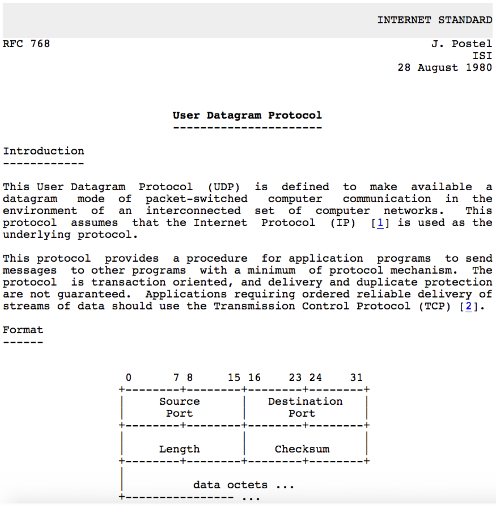

# Transportation Layer

#### Transport Services and Protocols
- **Primary Role**: To provide logical communication between application processes (not just hosts) running on different end systems.
- **Sender Actions**: At the sender, the transport layer takes application-layer messages, breaks them into smaller chunks called segments, adds a transport-layer header, and passes these segments down to the network layer.
- **Receiver Actions**: At the receiver, the transport layer reassembles the received segments back into the original messages and delivers them to the correct application process.
- The Internet offers two primary transport protocols: TCP (reliable) and UDP (unreliable).

#### Transport vs. Network Layer Services
- **Network Layer (IP)**: Provides logical communication between hosts. It is responsible for delivering packets from the source host to the destination host.
- **Transport Layer (TCP/UDP)**: Provides logical communication between processes (applications) within those hosts. It extends the host-to-host delivery service of the network layer to a process-to-process delivery service.

#### Transport Layer Actions (Sender & Receiver)

##### Sender Side
1. Receives an application-layer message from the application process above.
2. Determines the values for the segment header fields (e.g., source/destination port numbers, sequence numbers for TCP, length for UDP).
3. Creates a transport-layer segment by encapsulating the application message with this header.
4. Passes the segment down to the network (IP) layer for delivery.

##### Receiver Side
1. Receives the segment from the network (IP) layer below.
2. Checks header values (for error detection, demultiplexing, etc.).
3. Extracts the application-layer message from the segment.
4. Demultiplexes the message: uses the header information (primarily the destination port number) to deliver the message to the correct socket, and thus the correct waiting application process.

#### Two Principal Internet Transport Protocols

**TCP (Transmission Control Protocol):**
- More precise demultiplexing using the 4-tuple (source & destination IP and port).
- Reliable, in-order byte-stream delivery.
- Congestion Control: Throttles the sender to prevent network overload.
- Flow Control: Prevents the sender from overwhelming the receiver.
- Connection-oriented: Requires a handshake to establish state before data exchange.

**UDP (User Datagram Protocol):**
- Simple demultiplexing using destination port number only.
- "Best-effort" service: Unreliable, unordered delivery. It is essentially a minimal extension of the IP datagram service to the application layer.
- No frills: No connection setup, no reliability, no congestion control, no flow control.

> Missing from Both: Neither TCP nor UDP provides performance guarantees like minimum bandwidth or maximum delay. They offer a best-effort service model.

# Multiplexing/Demultiplexing

```
        Host A                         Host B                         Host C
   ┌──────────────┐             ┌──────────────┐             ┌──────────────┐
   │  Application │             │  Application │             │  Application │
   │     P3       │◄───────────►│   P1   P2    │◄───────────►│      P4      │
   ├──────────────┤             ├──────────────┤             ├──────────────┤
   │   Transport  │             │   Transport  │             │   Transport  │
   │   (Socket)   │◄───────────►│   (Socket)   │◄───────────►│   (Socket)   │
   ├──────────────┤             ├──────────────┤             ├──────────────┤
   │   Network    │             │   Network    │             │   Network    │
   ├──────────────┤             ├──────────────┤             ├──────────────┤
   │     Link     │             │     Link     │             │     Link     │
   ├──────────────┤             ├──────────────┤             ├──────────────┤
   │   Physical   │             │   Physical   │             │   Physical   │
   └──────────────┘             └──────────────┘             └──────────────┘

```

- **Multiplexing (at sender)**: The job of gathering data chunks from multiple application processes (different sockets), encapsulating each with a header (which will later be used for demultiplexing), and passing them to the network layer. Many sockets, one network path.
- **Demultiplexing (at receiver)**: The job of delivering the data in received transport-layer segments to the correct application process (socket) by examining the header fields in the segment. One network path, many sockets.

##### Question
When the server receives a segment, how does it know which local process (e.g., an HTTP response) should go to a waiting Firefox process vs. another service?
##### Demultiplexing at Receiver
Shows incoming segments being directed to different sockets/processes on the server based on header information.
##### Multiplexing at Sender
Shows the client's transport layer gathering data from multiple application sockets and sending them out as segments.

#### How Demultiplexing Works – The Gist

```
<-------------------32 bits-------------------->
+-----------------------+----------------------+
|     Source Port       |    Destination Port  |
+-----------------------+----------------------+
|            Other Header Fields               |
+----------------------------------------------+
|                                              |
|          Application Data (Payload)          |
|                                              |
+----------------------------------------------+
             TCP / UDP Segment Format
```

- A host uses a combination of IP addresses (network layer) and port numbers (transport layer) to direct an incoming segment to the right socket.
- The critical fields for demultiplexing are the source port number and destination port number, contained in the transport-layer segment header. 

#### Connectionless Demultiplexing (UDP)

- Socket Creation: A UDP socket is bound to a specific, host-local port number when created (e.g., DatagramSocket(12534)).
- Demultiplexing Rule: The receiving host examines the destination port number in the UDP segment header. It directs the segment to the one and only socket bound to that port number.
- Important Characteristic: UDP demultiplexing only looks at the destination port number. All datagrams arriving at a host with the same destination port number will be directed to the same socket, regardless of their source IP address or source port.

```
+------------------------+               +------------------------+               +------------------------+
| mySocket = socket      |               | mySocket = socket      |               | mySocket = socket      |
| (AF_INET, SOCK_DGRAM); |               | (AF_INET, SOCK_DGRAM); |               | (AF_INET, SOCK_DGRAM); |
| mySocket.bind          |               | mySocket.bind          |               | mySocket.bind          |
| (myAddr, 9157);        |               | (myAddr, 6428);        |               | (myAddr, 5775);        |
+------------------------+               +------------------------+               +------------------------+

        Host A                                      Host B                                       Host C
   ┌──────────────┐     <- source port: 6428  ┌──────────────┐      source port: -> .... ┌──────────────┐
   │  Application │     <- dest port: 9157    │  Application │      dest port: ->  ....  │  Application │
   │     P3       │◄─────────────────────────►│      P1      │◄─────────────────────────►│      P4      │
   ├──────────────┤                           ├──────────────┤                           ├──────────────┤
   │   Transport  │    source port: -> 9157   │   Transport  │    <- source port: ....   │   Transport  │
   │              │    dest port: ->  6428    │              │    <- dest port: ....     │              │ 
   │   (Socket)   │◄─────────────────────────►│   (Socket)   │◄─────────────────────────►│   (Socket)   │
   ├──────────────┤                           ├──────────────┤                           ├──────────────┤
   │   Network    │                           │   Network    │                           │   Network    │
   ├──────────────┤                           ├──────────────┤                           ├──────────────┤
   │     Link     │                           │     Link     │                           │     Link     │
   ├──────────────┤                           ├──────────────┤                           ├──────────────┤
   │   Physical   │                           │   Physical   │                           │   Physical   │
   └──────────────┘                           └──────────────┘                           └──────────────┘

```

#### Connection-Oriented Demultiplexing (TCP)

Socket Identification: A TCP socket is uniquely identified by a 4-tuple:
1. Source IP address
2. Source port number
3. Destination IP address
4. Destination port number

- Demultiplexing Rule: The receiver uses all four values to direct an incoming segment to a specific socket.
- Consequence: This allows a server (like a web server on port 80) to have many simultaneous TCP sockets, one for each connected client. Each client connection is distinguished by its unique source IP:port pair.

```
        address A                                address B                                  address C
        host: IP                                 server: IP                                 host: IP 
   ┌──────────────┐  <- source IP, port: B,80 ┌──────────────┐ source ip, port: -> C,5775┌──────────────┐
   │  Application │  <- dest IP, port: A,9157 │  Application │ dest port: ->  B,80       │  Application │
   │     P1       │◄─────────────────────────►│  P4  P5  P6  │◄─────────────────────────►│      P4      │
   ├──────────────┤                           ├──────────────┤                           ├──────────────┤
   │   Transport  │ source IP, port: -> A,9157│   Transport  │  <- source port: C,9157   │   Transport  │
   │              │ dest IP, port: ->  B80    │              │  <- dest port: B,80       │              │ 
   │   (Socket)   │◄─────────────────────────►│   (Socket)   │◄─────────────────────────►│   (Socket)   │
   ├──────────────┤                           ├──────────────┤                           ├──────────────┤
   │   Network    │                           │   Network    │                           │   Network    │
   ├──────────────┤                           ├──────────────┤                           ├──────────────┤
   │     Link     │                           │     Link     │                           │     Link     │
   ├──────────────┤                           ├──────────────┤                           ├──────────────┤
   │   Physical   │                           │   Physical   │                           │   Physical   │
   └──────────────┘                           └──────────────┘                           └──────────────┘

```

## UDP: User Datagram Protocol

#### Characteristics
- **Service Model**: UDP is a minimal, "no-frills" transport protocol. It provides "best-effort" service, meaning segments can be lost, duplicated, or delivered out of order to the application.
- **Connectionless**: There is no handshaking to establish a connection. Each UDP segment is processed independently.
- **Why Use UDP? Key Advantages:**
  1. **No Connection Establishment Delay**: Avoids the RTT delay of a setup handshake (important for real-time apps).
  2. **Simplicity**: No connection state to maintain at sender or receiver, making it lightweight.
  3. **Small Header Overhead**: The 8-byte header is small compared to TCP's 20+ bytes.
  4. **No Congestion Control**: The sender can transmit at the application's native rate without being throttled by the transport layer. This is a double-edged sword: it can cause congestion but allows the app to function even when the network is impaired (e.g., VoIP).

#### UDP Use Cases

**Typical Applications:**
- **Streaming Multimedia**: Loss-tolerant but sensitive to timing and rate (e.g., live video, VoIP).
- **DNS**: Simple query/response where speed is critical and a retransmission can be sent if needed.
- **SNMP**: Network management queries.
- **HTTP/3**: The latest HTTP version uses QUIC, which is built on top of UDP, adding its own reliability and congestion control mechanisms at the application layer.

> Design Philosophy: If an application needs reliability or congestion control, it must implement these features itself within the application layer, as HTTP/3 does.

#### UDP RFC 768
- **Official Standard:** This slide shows the original 1980 RFC that defines UDP.
- **Key Points from the RFC:**
  - UDP provides a datagram mode of communication.
  - It assumes IP is the underlying protocol.
  - It offers minimum protocol mechanism (very simple).
  - It is transaction-oriented and does not guarantee delivery or protection against duplicates.
  - Applications needing reliable, ordered streams should use TCP.



