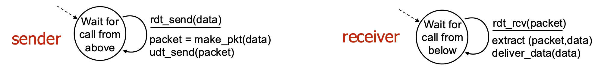
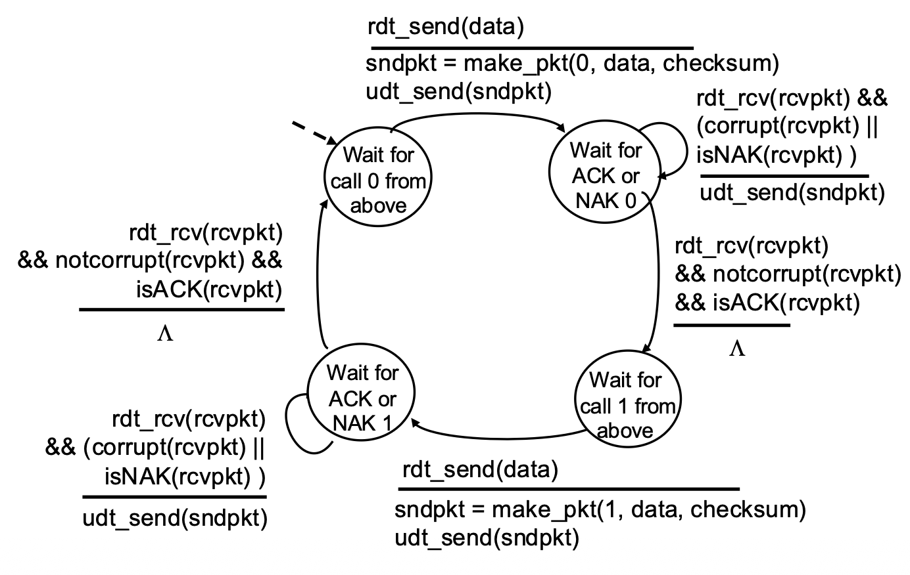
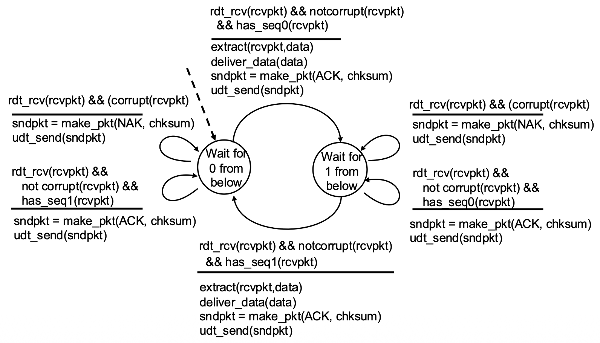
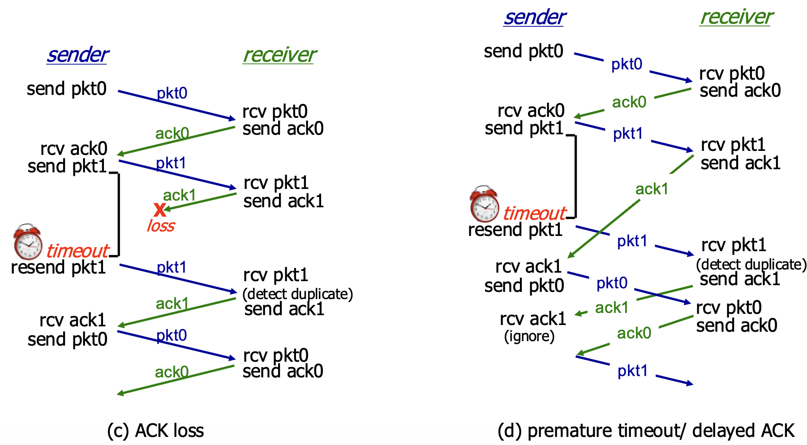
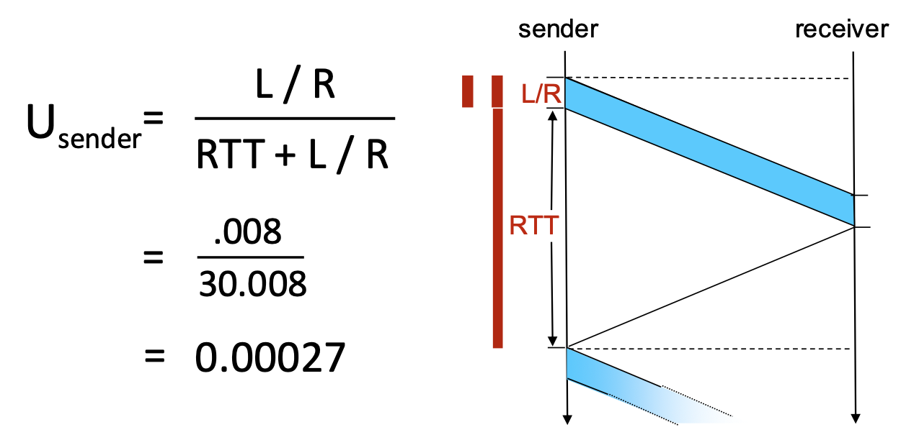

# Transportation Layer

#### Transport Services and Protocols
- **Primary Role**: To provide logical communication between application processes (not just hosts) running on different end systems.
- **Sender Actions**: At the sender, the transport layer takes application-layer messages, breaks them into smaller chunks called segments, adds a transport-layer header, and passes these segments down to the network layer.
- **Receiver Actions**: At the receiver, the transport layer reassembles the received segments back into the original messages and delivers them to the correct application process.
- The Internet offers two primary transport protocols: TCP (reliable) and UDP (unreliable).

#### Transport vs. Network Layer Services
- **Network Layer (IP)**: Provides logical communication between hosts. It is responsible for delivering packets from the source host to the destination host.
- **Transport Layer (TCP/UDP)**: Provides logical communication between processes (applications) within those hosts. It extends the host-to-host delivery service of the network layer to a process-to-process delivery service.

#### Transport Layer Actions (Sender & Receiver)

##### Sender Side
1. Receives an application-layer message from the application process above.
2. Determines the values for the segment header fields (e.g., source/destination port numbers, sequence numbers for TCP, length for UDP).
3. Creates a transport-layer segment by encapsulating the application message with this header.
4. Passes the segment down to the network (IP) layer for delivery.

##### Receiver Side
1. Receives the segment from the network (IP) layer below.
2. Checks header values (for error detection, demultiplexing, etc.).
3. Extracts the application-layer message from the segment.
4. Demultiplexes the message: uses the header information (primarily the destination port number) to deliver the message to the correct socket, and thus the correct waiting application process.

#### Two Principal Internet Transport Protocols

**TCP (Transmission Control Protocol):**
- More precise demultiplexing using the 4-tuple (source & destination IP and port).
- Reliable, in-order byte-stream delivery.
- Congestion Control: Throttles the sender to prevent network overload.
- Flow Control: Prevents the sender from overwhelming the receiver.
- Connection-oriented: Requires a handshake to establish state before data exchange.

**UDP (User Datagram Protocol):**
- Simple demultiplexing using destination port number only.
- "Best-effort" service: Unreliable, unordered delivery. It is essentially a minimal extension of the IP datagram service to the application layer.
- No frills: No connection setup, no reliability, no congestion control, no flow control.

> Missing from Both: Neither TCP nor UDP provides performance guarantees like minimum bandwidth or maximum delay. They offer a best-effort service model.

# Multiplexing/Demultiplexing

```
        Host A                         Host B                         Host C
   ┌──────────────┐             ┌──────────────┐             ┌──────────────┐
   │  Application │             │  Application │             │  Application │
   │     P3       │◄───────────►│   P1   P2    │◄───────────►│      P4      │
   ├──────────────┤             ├──────────────┤             ├──────────────┤
   │   Transport  │             │   Transport  │             │   Transport  │
   │   (Socket)   │◄───────────►│   (Socket)   │◄───────────►│   (Socket)   │
   ├──────────────┤             ├──────────────┤             ├──────────────┤
   │   Network    │             │   Network    │             │   Network    │
   ├──────────────┤             ├──────────────┤             ├──────────────┤
   │     Link     │             │     Link     │             │     Link     │
   ├──────────────┤             ├──────────────┤             ├──────────────┤
   │   Physical   │             │   Physical   │             │   Physical   │
   └──────────────┘             └──────────────┘             └──────────────┘

```

- **Multiplexing (at sender)**: The job of gathering data chunks from multiple application processes (different sockets), encapsulating each with a header (which will later be used for demultiplexing), and passing them to the network layer. Many sockets, one network path.
- **Demultiplexing (at receiver)**: The job of delivering the data in received transport-layer segments to the correct application process (socket) by examining the header fields in the segment. One network path, many sockets.

##### Question
When the server receives a segment, how does it know which local process (e.g., an HTTP response) should go to a waiting Firefox process vs. another service?
##### Demultiplexing at Receiver
Shows incoming segments being directed to different sockets/processes on the server based on header information.
##### Multiplexing at Sender
Shows the client's transport layer gathering data from multiple application sockets and sending them out as segments.

#### How Demultiplexing Works – The Gist

```
<-------------------32 bits-------------------->
+-----------------------+----------------------+
|     Source Port       |    Destination Port  |
+-----------------------+----------------------+
|            Other Header Fields               |
+----------------------------------------------+
|                                              |
|          Application Data (Payload)          |
|                                              |
+----------------------------------------------+
             TCP / UDP Segment Format
```

- A host uses a combination of IP addresses (network layer) and port numbers (transport layer) to direct an incoming segment to the right socket.
- The critical fields for demultiplexing are the source port number and destination port number, contained in the transport-layer segment header. 

#### Connectionless Demultiplexing (UDP)

- Socket Creation: A UDP socket is bound to a specific, host-local port number when created (e.g., DatagramSocket(12534)).
- Demultiplexing Rule: The receiving host examines the destination port number in the UDP segment header. It directs the segment to the one and only socket bound to that port number.
- Important Characteristic: UDP demultiplexing only looks at the destination port number. All datagrams arriving at a host with the same destination port number will be directed to the same socket, regardless of their source IP address or source port.

```
+------------------------+               +------------------------+               +------------------------+
| mySocket = socket      |               | mySocket = socket      |               | mySocket = socket      |
| (AF_INET, SOCK_DGRAM); |               | (AF_INET, SOCK_DGRAM); |               | (AF_INET, SOCK_DGRAM); |
| mySocket.bind          |               | mySocket.bind          |               | mySocket.bind          |
| (myAddr, 9157);        |               | (myAddr, 6428);        |               | (myAddr, 5775);        |
+------------------------+               +------------------------+               +------------------------+

        Host A                                      Host B                                       Host C
   ┌──────────────┐     <- source port: 6428  ┌──────────────┐      source port: -> .... ┌──────────────┐
   │  Application │     <- dest port: 9157    │  Application │      dest port: ->  ....  │  Application │
   │     P3       │◄─────────────────────────►│      P1      │◄─────────────────────────►│      P4      │
   ├──────────────┤                           ├──────────────┤                           ├──────────────┤
   │   Transport  │    source port: -> 9157   │   Transport  │    <- source port: ....   │   Transport  │
   │              │    dest port: ->  6428    │              │    <- dest port: ....     │              │ 
   │   (Socket)   │◄─────────────────────────►│   (Socket)   │◄─────────────────────────►│   (Socket)   │
   ├──────────────┤                           ├──────────────┤                           ├──────────────┤
   │   Network    │                           │   Network    │                           │   Network    │
   ├──────────────┤                           ├──────────────┤                           ├──────────────┤
   │     Link     │                           │     Link     │                           │     Link     │
   ├──────────────┤                           ├──────────────┤                           ├──────────────┤
   │   Physical   │                           │   Physical   │                           │   Physical   │
   └──────────────┘                           └──────────────┘                           └──────────────┘

```

#### Connection-Oriented Demultiplexing (TCP)

Socket Identification: A TCP socket is uniquely identified by a 4-tuple:
1. Source IP address
2. Source port number
3. Destination IP address
4. Destination port number

- Demultiplexing Rule: The receiver uses all four values to direct an incoming segment to a specific socket.
- Consequence: This allows a server (like a web server on port 80) to have many simultaneous TCP sockets, one for each connected client. Each client connection is distinguished by its unique source IP:port pair.

```
        address A                                address B                                  address C
        host: IP                                 server: IP                                 host: IP 
   ┌──────────────┐  <- source IP, port: B,80 ┌──────────────┐ source ip, port: -> C,5775┌──────────────┐
   │  Application │  <- dest IP, port: A,9157 │  Application │ dest port: ->  B,80       │  Application │
   │     P1       │◄─────────────────────────►│  P4  P5  P6  │◄─────────────────────────►│      P4      │
   ├──────────────┤                           ├──────────────┤                           ├──────────────┤
   │   Transport  │ source IP, port: -> A,9157│   Transport  │  <- source port: C,9157   │   Transport  │
   │              │ dest IP, port: ->  B80    │              │  <- dest port: B,80       │              │ 
   │   (Socket)   │◄─────────────────────────►│   (Socket)   │◄─────────────────────────►│   (Socket)   │
   ├──────────────┤                           ├──────────────┤                           ├──────────────┤
   │   Network    │                           │   Network    │                           │   Network    │
   ├──────────────┤                           ├──────────────┤                           ├──────────────┤
   │     Link     │                           │     Link     │                           │     Link     │
   ├──────────────┤                           ├──────────────┤                           ├──────────────┤
   │   Physical   │                           │   Physical   │                           │   Physical   │
   └──────────────┘                           └──────────────┘                           └──────────────┘

```

## UDP: User Datagram Protocol

#### Characteristics
- **Service Model**: UDP is a minimal, "no-frills" transport protocol. It provides "best-effort" service, meaning segments can be lost, duplicated, or delivered out of order to the application.
- **Connectionless**: There is no handshaking to establish a connection. Each UDP segment is processed independently.
- **Why Use UDP? Key Advantages:**
  1. **No Connection Establishment Delay**: Avoids the RTT delay of a setup handshake (important for real-time apps).
  2. **Simplicity**: No connection state to maintain at sender or receiver, making it lightweight.
  3. **Small Header Overhead**: The 8-byte header is small compared to TCP's 20+ bytes.
  4. **No Congestion Control**: The sender can transmit at the application's native rate without being throttled by the transport layer. This is a double-edged sword: it can cause congestion but allows the app to function even when the network is impaired (e.g., VoIP).

#### UDP Use Cases

**Typical Applications:**
- **Streaming Multimedia**: Loss-tolerant but sensitive to timing and rate (e.g., live video, VoIP).
- **DNS**: Simple query/response where speed is critical and a retransmission can be sent if needed.
- **SNMP**: Network management queries.
- **HTTP/3**: The latest HTTP version uses QUIC, which is built on top of UDP, adding its own reliability and congestion control mechanisms at the application layer.

> Design Philosophy: If an application needs reliability or congestion control, it must implement these features itself within the application layer, as HTTP/3 does.

#### UDP RFC 768
- **Official Standard:** This slide shows the original 1980 RFC that defines UDP.
- **Key Points from the RFC:**
  - UDP provides a datagram mode of communication.
  - It assumes IP is the underlying protocol.
  - It offers minimum protocol mechanism (very simple).
  - It is transaction-oriented and does not guarantee delivery or protection against duplicates.
  - Applications needing reliable, ordered streams should use TCP.


#### UDP Transport Layer Actions

```
        SNMP CLIENT                                 SNMP SERVER
+------------------------+                   +------------------------+
|      application       |                   |      application       |
|        (SNMP)          |                   |        (SNMP)          |
+------------------------+                   +------------------------+
|      transport         |                   |      transport         |
|        (UDP)           |                   |        (UDP)           |
+------------------------+                   +------------------------+
|       network          |                   |       network          |
|         (IP)           |                   |         (IP)           |
+------------------------+                   +------------------------+
|        link            |                   |        link            |
+------------------------+                   +------------------------+
|      physical          |                   |      physical          |
+------------------------+                   +------------------------+
           |                                        |
           |                                        |
           +-------------  IP Network  -------------+
```

**UDP Sender Actions**:
- Receives an application-layer message (SNMP msg).
- Determines UDP header field values (source/dest ports, length, checksum).
- Creates a UDP segment by adding the header.
- Passes the segment to the IP layer.

**UDP Receiver Actions**:
- Receives the segment from the IP layer.
- Checks the UDP checksum for errors.
- Extracts the application-layer message.
- Demultiplexes the message to the correct application socket based on the destination port number.

#### UDP Segment Header

```
<-------------------32 bits-------------------->
+-----------------------+----------------------+
|     Source Port       |    Destination Port  |
+-----------------------+----------------------+
|        length         |       checksum       |
+----------------------------------------------+
|                                              |
|          Application Data (Payload)          |
|                                              |
+----------------------------------------------+
             TCP / UDP Segment Format
```

Header Fields (8 bytes total):
- Source Port Number (16 bits)
- Destination Port Number (16 bits)
- Length (16 bits): Total length of the UDP segment (header + data) in bytes.
- Checksum (16 bits): Used for error detection.
Payload: The data from the application layer follows the header.

#### UDP Checksum & Internet Checksum

**Goal**: To detect errors (flipped bits) in the transmitted segment. It is not for error correction.

**Sender's Job**:
- Treats the entire UDP segment (and parts of the IP pseudo-header) as a sequence of 16-bit integers.
- Adds them all together using one's complement addition.
- Takes the one's complement of this sum, which becomes the checksum value placed in the header.

**Receiver's Job**:
- Performs the same calculation on the received segment (including the checksum field).
- If the result is all 1 bits (one's complement of 0), no error is detected. Otherwise, an error is detected, and the segment is silently discarded.

**Weakness**: The Internet checksum provides weak protection. It can fail to detect certain types of errors (e.g., reordered 16-bit words or compensating bit flips across words), as shown in the example where the sum remains unchanged despite bit flips.

#### Summary: UDP

> **Recap**: UDP is a simple, unreliable, connectionless datagram protocol.
> **Advantages Reiterated**:
> - Low overhead and latency (no connection setup).
> - Robustness in impaired network conditions (no forced slowdown from congestion control).
> - Provides a basic error detection mechanism (checksum).
> **Final Point**: UDP serves as a flexible substrate. Applications that need more sophisticated services (like HTTP/3) can build them on top of UDP, giving them > more control than TCP allows.

# Reliable Data Transfer (RDT)

```
         RELIABLE SERVICE (ABSTRACTION)                                      RELIABLE SERVICE (IMPLEMENTATION)
                                                                                 
sending process                        receiving process      ->       sending process                        receiving process       
+---------------+                      +---------------+      ->       +---------------+                      +---------------+      
|   application |                      |   application |      ->       |   application |                      |   application |        
|     data      |                      |     data      |      ->       |     data      |                      |     data      |        
+-------+-------+                      +-------+-------+      ->       +-------+-------+                      +-------+-------+        
        |                                      ^              ->               |                                      ^       
        |                                      |              ->               |                                      |      
        |        reliable channel              |              ->       +-----------------------+        +-----------------------+      
        +--------------------------------------+              ->       |  sender-side reliable |        | receiver-side reliable|        
                                                              ->       |   data transfer       |        |   data transfer       |              
                                                              ->       +-----------------------+        +-----------------------+              
                                                              ->               |                                      ^           
                                                                               |                                      |      
                                                                               +------------ unreliable channel ------+      
                                                                                             (network)                                  
```

#### The Principles

- **Goal**: To provide the abstraction of a perfectly reliable channel to the upper layers (the application processes), even though the underlying communication medium (network) is unreliable.
- **Abstraction**: From the application's viewpoint, data sent by the sending process simply arrives correctly at the receiving process.

#### The Implementation Reality

- Reality Check: The reliable channel is an abstraction. The actual implementation uses an unreliable channel (e.g., the network) that can lose, corrupt, or reorder packets.
- Protocol's Job: To implement the reliable service by adding logic on both the sender and receiver sides. This logic forms the Reliable Data Transfer (RDT) protocol.

#### Complexity Depends on Channel

- The complexity of the RDT protocol is directly determined by the characteristics of the unreliable channel it must overcome.
- The protocol design becomes more complex as the channel model becomes more hostile.

#### The State Problem

- **Fundamental Challenge**: The sender and receiver are separated entities. They cannot directly know each other's internal "state" (e.g., whether a packet was received).
- **Solution via Messaging**: The only way for them to coordinate and infer each other's state is by exchanging control messages (like acknowledgements - ACKs) over the unreliable channel itself.

#### RDT Protocol Interfaces (Service Primitives)

```
            SENDING PROCESS                              RECEIVING PROCESS
      +-----------------------+                     +-----------------------+
      |        data           |                     |        data           |
      |   (application)       |                     |   (application)       |
      +-----------+-----------+                     +-----------+-----------+
                  |                                             ^
                  | rdt_send()                                  | deliver_data()
                  |                                             |
  --------------------------------              ----------------------------------
  |  sender-side implementation  |              |  receiver-side implementation  |
  |  of rdt                      |              |  of rdt                        |
  |  packet = make_pkt(data)     |              |  rdt_rcv(packet)               |
  |  udt_send(packet)            |              |  extract(data)                 |
  --------------------------------              ----------------------------------
                  |                                             ^
                  |                                             |
      +-----------+-----------+                     +-----------+-----------+
      |        data           |                     |        data           |
      |   (application)       |                     |   (application)       |
      +-----------------------+                     +-----------------------+
                  |                                             ^
                  |                                             |
                  +------------ unreliable channel -------------+

```

**Sender Side**:
- `rdt_send()`: Called by the upper-layer application to pass data down for reliable delivery.
- `udt_send()`: Called by the RDT protocol to send a packet over the underlying unreliable channel.

**Receiver Side**:
- `rdt_rcv()`: Called when a packet arrives from the channel.
- `deliver_data()`: Called by the RDT protocol to hand delivered data up to the application layer.

#### Reliable Data Transfer: Getting Started Methodology 

- **Approach**: Incremental, layered development of the protocol. We start with a simple perfect channel and add complications one by one.
- **Scope**: Focus on unidirectional data transfer (one sender, one receiver), but note that control information (ACKs) must flow in the reverse direction.
- **Tool**: Finite State Machines (FSMs): Used to specify the behavior of the sender and receiver. An FSM defines states, events that cause transitions, and actions taken during transitions.

#### rdt1.0 – Reliable Transfer Over a Reliable Channel

- **Assumption**: The underlying channel is perfectly reliable (no bit errors, no loss). This is a hypothetical starting point.
- **Protocol Logic**: Trivial.
  - **Sender FSM**: Wait for data from above, packetize it, send it.
  - **Receiver FSM**: Wait for packet from below, extract data, deliver it up.
- No feedback needed because the channel is perfect.



#### rdt2.0 – Channel With Bit Errors

- **New Challenge**: The channel can flip bits (corrupt packets). We use a checksum to detect errors.
- **Recovery Mechanism**:
  - **Feedback**: Receiver sends explicit control messages back to sender:
    - **ACK**: Acknowledgement (packet received OK).
      - receiver explicitly tells sender that pkt received OK
    - **NAK**: Negative Acknowledgement (packet had errors).
      - receiver explicitly tells sender that pkt had errors
  - **Retransmission**: Sender retransmits the packet upon receiving a NAK.
- **Protocol Style**: Stop-and-Wait. The sender sends one packet and then stops to wait for the receiver's response (ACK or NAK) before sending the next.

#### rdt2.0 – FSM Specification and Corrupted Packet Scenario


- **Sender Logic**: Has two main states: "Wait for call from above" (ready to send) and "Wait for ACK or NAK" (waiting for feedback). On NAK or corrupted ACK, it retransmits.
- **Receiver Logic**: Sends ACK for good packets, NAK for corrupted packets.

#### rdt2.0 Has a Fatal Flaw!

- **The Problem**: What if the ACK or NAK message itself becomes corrupted? The sender cannot interpret the corrupted feedback and doesn't know if the receiver got the packet.
- **Naïve Solution (Flawed)**: If the sender simply retransmits on corrupted feedback, it may cause duplicate packets if the ACK was actually OK but just corrupted in transit.
- **Real Solution (rdt2.1)**: The sender adds a sequence number (just 1 bit: 0 or 1) to each data packet. The receiver uses this number to detect and discard duplicate packets.

#### rdt2.1 – Handling Garbled ACK/NAKs

**Key Changes:**
- **Sequence Numbers**: Packets are labeled 0 or 1.
- **Sender States**: Doubled. The sender now has separate states for waiting for ACK/NAK for packet 0 and for packet 1. This allows it to know which packet is being acknowledged.
- **Receiver Logic**: Checks the sequence number. If it receives the expected packet (0 or 1), it delivers data and sends ACK. If it receives a duplicate (e.g., 0 again), it simply re-ACKs it, telling the sender "I already have 0, send the next one (1)."

**rdt2.1 Sender Handling Garbled**:


**rdt2.1 Receiver Handling Garbled**:


- **Sender**: 
  - Needs only 2 sequence numbers (0,1) for a stop-and-wait protocol because only one outstanding packet exists at a time.
  - Must check if received ACK/NAK corrupted.
- **States**:
  - The number of states doubled to track which packet (0 or 1) is expected or in flight.
- **Receiver**: 
  - Must also track the expected sequence number.

**Note**: receiver can not know if its last ACK/NAK received OK at sender

#### rdt2.2 – A NAK-Free Protocol

- **Optimization**: Achieves the same reliability as rdt2.1 but eliminates the NAK message.
- **Mechanism**: The receiver always sends an ACK. However, the ACK explicitly includes the sequence number of the packet it is acknowledging (e.g., `ACK0`, `ACK1`).
- **How it Handles Errors**: If the sender receives a duplicate ACK (e.g., gets `ACK0` again when expecting `ACK1`), it interprets this the same way as a NAK—it means the receiver did not get the next packet correctly, so the sender retransmits.
- **Significance**: This ACK-with-sequence-number approach is used by TCP (it uses cumulative ACKs, a related concept).

**rdt2.2 Sender and Receiver Fragments**:


#### rdt3.0: Channels with Errors and Loss

- **New Challenge**: The underlying channel is now modeled as unreliable in the worst way: it can lose packets (both data packets and ACK packets). Bit errors are also possible.
- **Available Tools**: We have checksums (error detection), sequence numbers (duplicate detection), ACKs (feedback), and retransmissions (recovery from errors).
- **The Gap**: These tools are not sufficient to handle loss. If a packet disappears, the sender receives no feedback at all (neither ACK nor NAK/corrupted ACK). It would wait forever.

#### rdt3.0: Approach – The Timeout & Retransmit Mechanism

- **Core Idea**: The sender sets a countdown timer after sending a packet. It waits a "reasonable" amount of time (the timeout interval) for an ACK.
- **Retransmission Trigger**: If the timer expires before an ACK is received, the sender assumes the packet (or its ACK) was lost and retransmits the packet.
- **Handling Delays, Not Loss**: If the packet or ACK was merely delayed (not lost), the retransmission creates a duplicate. This is okay because the sequence numbers (from rdt2.1/2.2) allow the receiver to detect and handle duplicates correctly.
- **Protocol Style**: Still Stop-and-Wait (one packet at a time), but now with a timer.

#### rdt3.0 Sender FSM

- Key Timer Actions:
  - `start_timer`: Started immediately after sending a packet.
  - `stop_timer`: Stopped when the correct ACK is received.
  - `timeout event`: A new event that triggers a transition. When it occurs, the sender retransmits the packet and restarts the timer.
- State Logic: Similar to rdt2.2, but now the sender must also handle the case where nothing happens (the timeout).


#### rdt3.0 in Action


**(a)** No Loss: Normal operation. Packet sent, ACK received, timer stopped, next packet sent.
**(b)** Packet Loss: The data packet is lost. Sender's timer expires, it retransmits the packet, and recovery proceeds.



**(c)** ACK Loss: The ACK is lost. Sender's timer expires, it retransmits (causing a duplicate at the receiver). Receiver detects the duplicate via sequence number, re-sends the ACK, and the sender moves on.
**(d)** Premature Timeout / Delayed ACK: The ACK is delayed, causing a timeout. The sender retransmits, creating a duplicate. The receiver gets the duplicate, discards it, and re-ACKs it. The sender eventually gets an ACK (could be from the first or second transmission) and proceeds. This shows the protocol is robust to timing variations.

#### Performance of rdt3.0 (Stop-and-Wait) – The Problem

- **Performance Metric**: Sender Utilization (U_sender). The fraction of time the sender is actually busy sending data vs. sitting idle.
- **Example Calculation**: 1 Gbps link, 15 ms propagation delay (RTT ~30 ms), 8000-bit packet.
- **Transmission Time (L/R)**: Time to push all bits of the packet onto the link -> `8000/10^9 = 8 microseconds`
- **Total Time per Packet**: The sender sends for 8 µs, then sits idle for the rest of the RTT waiting for the ACK. Total cycle time -> `RTT + L/R ≈ 30.008 ms`


- **Utilization**: U_sender -> `(L/R) / (RTT + L/R) = 0.008 / 30.008 ≈ 0.00027`



- **Conclusion**: The sender is busy only 0.027% of the time! The protocol severely underutilizes the high-capacity link. It limits performance far below what the physical infrastructure can suppor

#### Pipelined Protocols

- **The Problem**: Stop-and-wait forces the sender to be idle for an entire RTT after each packet.
- **The Solution**: Pipelining. Allow the sender to have multiple, "in-flight" packets (sent but not yet acknowledged) simultaneously.

#### Benefits of Pipelining:

- Dramatically increases sender utilization.
- **Example**: With a window of 3 packets in flight, utilization increases by a factor of 3 (from ~0.00027 to ~0.0008 in the example—still low due to huge RTT/bandwidth product, but the principle holds).


