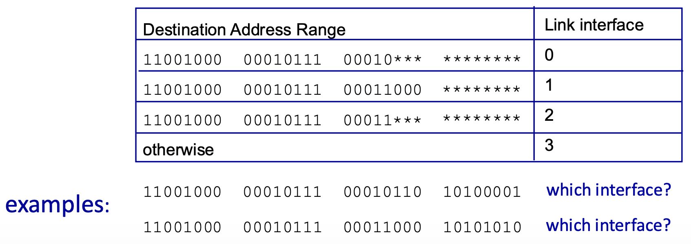
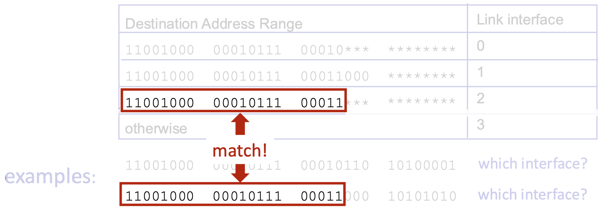

#### Transport Layer Actions (Sender & Receiver)
**Sender Side**
1. Receives an application-layer message from the application process above.
2. Determines the values for the segment header fields (e.g., source/destination port numbers, sequence numbers for TCP, length for UDP).
3. Creates a transport-layer segment by encapsulating the application message with this header.
4. Passes the segment down to the network (IP) layer for delivery.

**Receiver Side**
1. Receives the segment from the network (IP) layer below.
2. Checks header values (for error detection, demultiplexing, etc.).
3. Extracts the application-layer message from the segment.
4. Demultiplexes the message: uses the header information (primarily the destination port number) to deliver the message to the correct socket, and thus the correct waiting application process.

##### Two Principal Internet Transport Protocols
**TCP (Transmission Control Protocol):**
- More precise demultiplexing using the 4-tuple (source & destination IP and port).
- Reliable, in-order byte-stream delivery.
- Congestion Control: Throttles the sender to prevent network overload.
- Flow Control: Prevents the sender from overwhelming the receiver.
- Connection-oriented: Requires a handshake to establish state before data exchange.
**UDP (User Datagram Protocol):**
- Simple demultiplexing using destination port number only.
- "Best-effort" service: Unreliable, unordered delivery. It is essentially a minimal extension of the IP datagram service to the application layer.
- No frills: No connection setup, no reliability, no congestion control, no flow control.

> Missing from Both: Neither TCP nor UDP provides performance guarantees like minimum bandwidth or maximum delay. They offer a best-effort service model.

#### Multiplexing/Demultiplexing
- **Multiplexing (at sender)**: The job of gathering data chunks from multiple application processes (different sockets), encapsulating each with a header (which will later be used for demultiplexing), and passing them to the network layer. Many sockets, one network path.
- **Demultiplexing (at receiver)**: The job of delivering the data in received transport-layer segments to the correct application process (socket) by examining the header fields in the segment. One network path, many sockets.

###### Question
When the server receives a segment, how does it know which local process (e.g., an HTTP response) should go to a waiting Firefox process vs. another service?
###### Demultiplexing at Receiver
Shows incoming segments being directed to different sockets/processes on the server based on header information.
###### Multiplexing at Sender
Shows the client's transport layer gathering data from multiple application sockets and sending them out as segments.

##### How Demultiplexing Works – The Gist
- A host uses a combination of IP addresses (network layer) and port numbers (transport layer) to direct an incoming segment to the right socket.
- The critical fields for demultiplexing are the source port number and destination port number, contained in the transport-layer segment header. 
##### Connectionless Demultiplexing (UDP)
- Socket Creation: A UDP socket is bound to a specific, host-local port number when created (e.g., DatagramSocket(12534)).
- Demultiplexing Rule: The receiving host examines the destination port number in the UDP segment header. It directs the segment to the one and only socket bound to that port number.
- Important Characteristic: UDP demultiplexing only looks at the destination port number. All datagrams arriving at a host with the same destination port number will be directed to the same socket, regardless of their source IP address or source port.

##### Connection-Oriented Demultiplexing (TCP)
Socket Identification: A TCP socket is uniquely identified by a 4-tuple:
1. Source IP address
2. Source port number
3. Destination IP address
4. Destination port number
- Demultiplexing Rule: The receiver uses all four values to direct an incoming segment to a specific socket.
- Consequence: This allows a server (like a web server on port 80) to have many simultaneous TCP sockets, one for each connected client. Each client connection is distinguished by its unique source IP:port pair.
#### UDP: User Datagram Protocol
**Characteristics**
- **Service Model**: UDP is a minimal, "no-frills" transport protocol. It provides "best-effort" service, meaning segments can be lost, duplicated, or delivered out of order to the application.
- **Connectionless**: There is no handshaking to establish a connection. Each UDP segment is processed independently.
- **Why Use UDP? Key Advantages:**
  1. **No Connection Establishment Delay**: Avoids the RTT delay of a setup handshake (important for real-time apps).
  2. **Simplicity**: No connection state to maintain at sender or receiver, making it lightweight.
  3. **Small Header Overhead**: The 8-byte header is small compared to TCP's 20+ bytes.
  4. **No Congestion Control**: The sender can transmit at the application's native rate without being throttled by the transport layer. This is a double-edged sword: it can cause congestion but allows the app to function even when the network is impaired (e.g., VoIP).
###### UDP Use Cases
**Typical Applications:**
- **Streaming Multimedia**: Loss-tolerant but sensitive to timing and rate (e.g., live video, VoIP).
- **DNS**: Simple query/response where speed is critical and a retransmission can be sent if needed.
- **SNMP**: Network management queries.
- **HTTP/3**: The latest HTTP version uses QUIC, which is built on top of UDP, adding its own reliability and congestion control mechanisms at the application layer.
> Design Philosophy: If an application needs reliability or congestion control, it must implement these features itself within the application layer, as HTTP/3 does.

##### UDP RFC 768
- **Key Points from the RFC:**
  - UDP provides a datagram mode of communication.
  - It assumes IP is the underlying protocol.
  - It offers minimum protocol mechanism (very simple).
  - It is transaction-oriented and does not guarantee delivery or protection against duplicates.
  - Applications needing reliable, ordered streams should use TCP.

##### UDP Transport Layer Actions
**UDP Sender Actions**:
- Receives an application-layer message (SNMP msg).
- Determines UDP header field values (source/dest ports, length, checksum).
- Creates a UDP segment by adding the header.
- Passes the segment to the IP layer.
**UDP Receiver Actions**:
- Receives the segment from the IP layer.
- Checks the UDP checksum for errors.
- Extracts the application-layer message.
- Demultiplexes the message to the correct application socket based on the destination port number.
##### UDP Segment Header
Header Fields (8 bytes total):
- Source Port Number (16 bits)
- Destination Port Number (16 bits)
- Length (16 bits): Total length of the UDP segment (header + data) in bytes.
- Checksum (16 bits): Used for error detection.
Payload: The data from the application layer follows the header.

##### UDP Checksum & Internet Checksum
**Goal**: To detect errors (flipped bits) in the transmitted segment. It is not for error correction.
**Sender's Job**:
- Treats the entire UDP segment (and parts of the IP pseudo-header) as a sequence of 16-bit integers.
- Adds them all together using one's complement addition.
- Takes the one's complement of this sum, which becomes the checksum value placed in the header.
**Receiver's Job**:
- Performs the same calculation on the received segment (including the checksum field).
- If the result is all 1 bits (one's complement of 0), no error is detected. Otherwise, an error is detected, and the segment is silently discarded.
**Weakness**: The Internet checksum provides weak protection. It can fail to detect certain types of errors (e.g., reordered 16-bit words or compensating bit flips across words), as shown in the example where the sum remains unchanged despite bit flips.
##### Summary: UDP
> **Recap**: UDP is a simple, unreliable, connectionless datagram protocol.
> **Advantages Reiterated**:
> - Low overhead and latency (no connection setup).
> - Robustness in impaired network conditions (no forced slowdown from congestion control).
> - Provides a basic error detection mechanism (checksum).
> **Final Point**: UDP serves as a flexible substrate. Applications that need more sophisticated services (like HTTP/3) can build them on top of UDP, giving them > more control than TCP allows.

##### Reliable Data Transfer (RDT) - The Principles
- **Goal**: To provide the abstraction of a perfectly reliable channel to the upper layers (the application processes), even though the underlying communication medium (network) is unreliable.
- **Abstraction**: From the application's viewpoint, data sent by the sending process simply arrives correctly at the receiving process.
##### The Implementation Reality
- Reality Check: The reliable channel is an abstraction. The actual implementation uses an unreliable channel (e.g., the network) that can lose, corrupt, or reorder packets.
- Protocol's Job: To implement the reliable service by adding logic on both the sender and receiver sides. This logic forms the Reliable Data Transfer (RDT) protocol.

##### Complexity Depends on Channel
- The complexity of the RDT protocol is directly determined by the characteristics of the unreliable channel it must overcome.
- The protocol design becomes more complex as the channel model becomes more hostile.

##### The State Problem
- **Fundamental Challenge**: The sender and receiver are separated entities. They cannot directly know each other's internal "state" (e.g., whether a packet was received).
- **Solution via Messaging**: The only way for them to coordinate and infer each other's state is by exchanging control messages (like acknowledgements - ACKs) over the unreliable channel itself.

##### RDT Protocol Interfaces (Service Primitives)
**Sender Side**:
- `rdt_send()`: Called by the upper-layer application to pass data down for reliable delivery.
- `udt_send()`: Called by the RDT protocol to send a packet over the underlying unreliable channel.
**Receiver Side**:
- `rdt_rcv()`: Called when a packet arrives from the channel.
- `deliver_data()`: Called by the RDT protocol to hand delivered data up to the application layer.

##### Reliable Data Transfer: Getting Started Methodology 
- **Approach**: Incremental, layered development of the protocol. We start with a simple perfect channel and add complications one by one.
- **Scope**: Focus on unidirectional data transfer (one sender, one receiver), but note that control information (ACKs) must flow in the reverse direction.
- **Tool**: Finite State Machines (FSMs): Used to specify the behavior of the sender and receiver. An FSM defines states, events that cause transitions, and actions taken during transitions.

##### rdt1.0 – Reliable Transfer Over a Reliable Channel
- **Assumption**: The underlying channel is perfectly reliable (no bit errors, no loss). This is a hypothetical starting point.
- **Protocol Logic**: Trivial.
  - **Sender FSM**: Wait for data from above, packetize it, send it.
  - **Receiver FSM**: Wait for packet from below, extract data, deliver it up.
- No feedback needed because the channel is perfect.

##### rdt2.0 – Channel With Bit Errors
- **New Challenge**: The channel can flip bits (corrupt packets). We use a checksum to detect errors.
- **Recovery Mechanism**:
  - **Feedback**: Receiver sends explicit control messages back to sender:
    - **ACK**: Acknowledgement (packet received OK).
      - receiver explicitly tells sender that pkt received OK
    - **NAK**: Negative Acknowledgement (packet had errors).
      - receiver explicitly tells sender that pkt had errors
  - **Retransmission**: Sender retransmits the packet upon receiving a NAK.
- **Protocol Style**: Stop-and-Wait. The sender sends one packet and then stops to wait for the receiver's response (ACK or NAK) before sending the next.

##### rdt2.0 – FSM Specification and Corrupted Packet Scenario
- **Sender Logic**: Has two main states: "Wait for call from above" (ready to send) and "Wait for ACK or NAK" (waiting for feedback). On NAK or corrupted ACK, it retransmits.
- **Receiver Logic**: Sends ACK for good packets, NAK for corrupted packets.

##### rdt2.0 Has a Fatal Flaw!
- **The Problem**: What if the ACK or NAK message itself becomes corrupted? The sender cannot interpret the corrupted feedback and doesn't know if the receiver got the packet.
- **Naïve Solution (Flawed)**: If the sender simply retransmits on corrupted feedback, it may cause duplicate packets if the ACK was actually OK but just corrupted in transit.
- **Real Solution (rdt2.1)**: The sender adds a sequence number (just 1 bit: 0 or 1) to each data packet. The receiver uses this number to detect and discard duplicate packets.

##### rdt2.1 – Handling Garbled ACK/NAKs
**Key Changes:**
- **Sequence Numbers**: Packets are labeled 0 or 1.
- **Sender States**: Doubled. The sender now has separate states for waiting for ACK/NAK for packet 0 and for packet 1. This allows it to know which packet is being acknowledged.
- **Receiver Logic**: Checks the sequence number. If it receives the expected packet (0 or 1), it delivers data and sends ACK. If it receives a duplicate (e.g., 0 again), it simply re-ACKs it, telling the sender "I already have 0, send the next one (1)."

- **Sender**: 
  - Needs only 2 sequence numbers (0,1) for a stop-and-wait protocol because only one outstanding packet exists at a time.
  - Must check if received ACK/NAK corrupted.
- **States**:
  - The number of states doubled to track which packet (0 or 1) is expected or in flight.
- **Receiver**: 
  - Must also track the expected sequence number.
**Note**: receiver can not know if its last ACK/NAK received OK at sender

##### rdt2.2 – A NAK-Free Protocol
- **Optimization**: Achieves the same reliability as rdt2.1 but eliminates the NAK message.
- **Mechanism**: The receiver always sends an ACK. However, the ACK explicitly includes the sequence number of the packet it is acknowledging (e.g., `ACK0`, `ACK1`).
- **How it Handles Errors**: If the sender receives a duplicate ACK (e.g., gets `ACK0` again when expecting `ACK1`), it interprets this the same way as a NAK—it means the receiver did not get the next packet correctly, so the sender retransmits.
- **Significance**: This ACK-with-sequence-number approach is used by TCP (it uses cumulative ACKs, a related concept).

##### rdt3.0: Channels with Errors and Loss
- **New Challenge**: The underlying channel is now modeled as unreliable in the worst way: it can lose packets (both data packets and ACK packets). Bit errors are also possible.
- **Available Tools**: We have checksums (error detection), sequence numbers (duplicate detection), ACKs (feedback), and retransmissions (recovery from errors).
- **The Gap**: These tools are not sufficient to handle loss. If a packet disappears, the sender receives no feedback at all (neither ACK nor NAK/corrupted ACK). It would wait forever.

##### rdt3.0: Approach – The Timeout & Retransmit Mechanism
- **Core Idea**: The sender sets a countdown timer after sending a packet. It waits a "reasonable" amount of time (the timeout interval) for an ACK.
- **Retransmission Trigger**: If the timer expires before an ACK is received, the sender assumes the packet (or its ACK) was lost and retransmits the packet.
- **Handling Delays, Not Loss**: If the packet or ACK was merely delayed (not lost), the retransmission creates a duplicate. This is okay because the sequence numbers (from rdt2.1/2.2) allow the receiver to detect and handle duplicates correctly.
- **Protocol Style**: Still Stop-and-Wait (one packet at a time), but now with a timer.

##### rd3.0 Sender FSM
- Key Timer Actions:
  - `start_timer`: Started immediately after sending a packet.
  - `stop_timer`: Stopped when the correct ACK is received.
  - `timeout event`: A new event that triggers a transition. When it occurs, the sender retransmits the packet and restarts the timer.
- State Logic: Similar to rdt2.2, but now the sender must also handle the case where nothing happens (the timeout).

##### rdt3.0 in Action
**(a)** No Loss: Normal operation. Packet sent, ACK received, timer stopped, next packet sent.
**(b)** Packet Loss: The data packet is lost. Sender's timer expires, it retransmits the packet, and recovery proceeds.
**(c)** ACK Loss: The ACK is lost. Sender's timer expires, it retransmits (causing a duplicate at the receiver). Receiver detects the duplicate via sequence number, re-sends the ACK, and the sender moves on.
**(d)** Premature Timeout / Delayed ACK: The ACK is delayed, causing a timeout. The sender retransmits, creating a duplicate. The receiver gets the duplicate, discards it, and re-ACKs it. The sender eventually gets an ACK (could be from the first or second transmission) and proceeds. This shows the protocol is robust to timing variations.

##### Performance of rdt3.0 (Stop-and-Wait) – The Problem
- **Performance Metric**: Sender Utilization (U_sender). The fraction of time the sender is actually busy sending data vs. sitting idle.
- **Example Calculation**: 1 Gbps link, 15 ms propagation delay (RTT ~30 ms), 8000-bit packet.
- **Transmission Time (L/R)**: Time to push all bits of the packet onto the link -> `8000/10^9 = 8 microseconds`
- **Total Time per Packet**: The sender sends for 8 µs, then sits idle for the rest of the RTT waiting for the ACK. Total cycle time -> `RTT + L/R ≈ 30.008 ms`
- **Utilization**: U_sender -> `(L/R) / (RTT + L/R) = 0.008 / 30.008 ≈ 0.00027`
- **Conclusion**: The sender is busy only 0.027% of the time! The protocol severely underutilizes the high-capacity link. It limits performance far below what the physical infrastructure can suppor
##### Pipelined Protocols
- **The Problem**: Stop-and-wait forces the sender to be idle for an entire RTT after each packet.
- **The Solution**: Pipelining. Allow the sender to have multiple, "in-flight" packets (sent but not yet acknowledged) simultaneously.
##### Benefits of Pipelining:
- Dramatically increases sender utilization.
- **Example**: With a window of 3 packets in flight, utilization increases by a factor of 3 (from ~0.00027 to ~0.0008 in the example—still low due to huge RTT/bandwidth product, but the principle holds).
# Go-Back-N (GBN)
##### Go-Back-N: Sender
- Core Concept: The sender maintains a sliding window of size N. It can transmit up to N consecutive packets without waiting for acknowledgements.
- **Sender Window Visualization:**
  - `send_base`: Sequence number of the oldest unacknowledged packet.
  - `nextseqnum`: Sequence number of the next packet to be sent.
  - The window contains packets already sent but not yet ACKed.
- **Key Mechanisms:**
  - **Cumulative ACKs**: An ACK with sequence number `n` acknowledges all packets up to and including n. When the sender receives ACK(n), it slides its window forward to begin at `n+1`.
  - **Single Timer**: The sender maintains only one timer for the oldest in-flight packet (`send_base`).
  - **Timeout Action**: If a timeout occurs for packet `n`, the sender retransmits packet `n` and all higher-numbered packets currently in its window (i.e., it goes back to n and re-sends everything from there). This is where the name comes from.

##### Go-Back-N: Receiver
- Receiver is Simple: The receiver only needs to remember one number: rcv_base (the expected sequence number of the next in-order packet).
- **Receiver Actions:**
  - **In-order Delivery**: If a packet with sequence number rcv_base arrives correctly, it's delivered to the app, an ACK is sent, and rcv_base is incremented.
  - **Out-of-Order Packets**: If a packet arrives with a sequence number higher than rcv_base (out-of-order), the receiver discards it (or can choose to buffer, but the standard GBN discards). Crucially, it re-sends an ACK for the last correctly received in-order packet (i.e., for sequence number rcv_base - 1). This generates duplicate ACKs.
  - **ACK Policy**: Receiver always sends an ACK for the highest in-order sequence number received so far.

##### Go-Back-N in Action
- Scenario: Window size N=4. Packet 2 is lost.
- **Sequence of Events:**
  1. Sender transmits packets 0,1,2,3,4,5.
  2. Receiver gets packets 0,1 (sends ACK0, ACK1). Packet 2 is lost.
  3. Receiver gets packets 3,4,5 (out-of-order). For each, it discards them and re-sends ACK1.
  4. Sender eventually gets multiple duplicate ACK1s (but GBN doesn't act on them specifically). The timer for packet 2 expires.
  5. Sender goes back to N=2 and retransmits packets 2,3,4,5.
- **Inefficiency**: Even though packets 3,4,5 were received correctly by the network layer at the receiver, they were discarded and must be retransmitted. This wastes bandwidth.

##### Selective Repeat (SR): The Approach
- **Goal**: Overcome the inefficiency of GBN by having the sender retransmit only the specific packets that are lost or corrupted.
- pipelining: multiple packets in flight
- **Key Features:**
  - **Receiver**: ACKs each correctly received packet individually, whether in-order or out-of-order. It buffers out-of-order packets.
  - **Sender**: Maintains a sliding window but also maintains a timer for each individual unACKed packet in the window.
  - **Timeout Action**: Only the specific timed-out packet is retransmitted.
##### Selective Repeat: Sender & Receiver Windows
- **Sender Window**: Identical in concept to GBN's sender window: defines the range of sequence numbers the sender can use.
- **Receiver Window**: The receiver also maintains a window of size N. It will accept and buffer any packet whose sequence number falls within this window. The window slides forward when the application delivers in-order data.
##### Selective Repeat: Sender and Receiver Rules
**Sender Rules:**
- Send packet if its sequence number is within the window.
- Timeout(n): Retransmit only packet n.
- ACK(n): Mark packet n as received. If n is the send_base (the smallest unACKed packet), slide the window forward to the next smallest unACKed sequence number.
**Receiver Rules:**
- Packet in window [rcvbase, rcvbase+N-1]: Send ACK(n). Buffer if out-of-order. Deliver in-order data (and any buffered, now-in-order data) to the app, then slide the window forward.
- Packet in [rcvbase-N, rcvbase-1]: This is a duplicate of a packet already ACKed (the receiver's window has already slid past it). Re-send ACK(n) to help the sender.
- Otherwise (packet outside receiver's window): Ignore it.

##### Selective Repeat in Action
- **Scenario**: Window size N=4. Packet 2 is lost.
- **Sequence of Events:**
  1. Sender transmits packets 0,1,2,3.
  2. Receiver gets 0,1 (sends ACK0, ACK1, delivers data). Gets packet 3 out-of-order (2 is lost). It buffers packet 3 and sends ACK3.
  3. Sender gets ACK0, ACK1, slides window and sends packets 4,5.
  4. Receiver gets packets 4,5, buffers them, sends ACK4, ACK5.
  6. Packet 2's timer expires. Sender retransmits only packet 2.
  7. When ACK2 finally arrives, the sender slides its window. At the receiver, packet 2 allows delivery of packets 2,3,4,5 in order, and the receiver window slides forward.
- **Efficiency**: Only the lost packet (2) was retransmitted, saving bandwidth compared to GBN.
##### Selective Repeat – A Dilemma! (The Sequence Number Wrap-Around Problem)
- **The Problem**: With a limited range of sequence numbers (e.g., 0,1,2,3) and a window size (N) that is too large relative to this range, ambiguity can arise.
- **Scenario (b)**: The receiver's window has slid forward, and it expects packets 3,0,1. An old, delayed packet from a previous cycle with sequence number 0 arrives. The receiver cannot distinguish this old, duplicate packet 0 from a new, valid packet 0 that belongs to the current window. It incorrectly accepts the old duplicate.
- **The Cause**: The receiver's view of the sequence number space overlaps with the sender's view in an ambiguous way because the sequence numbers have wrapped around.
- **Solution**: To avoid this, the sequence number space must be larger than the window size. More precisely, for SR protocol to work correctly, the number of available sequence numbers must be at least twice the sender window size (`MaxSeqNum` >= 2 * N). This ensures that the receiver's window never overlaps ambiguously with the sender's previous window.
#### TCP
- **Point-to-Point**: A TCP connection is between exactly one sender and one receiver.
- **Reliable, In-Order Byte Stream**: Provides an unstructured, continuous flow of bytes to the application. It does not preserve "message boundaries" sent by the application.
- **Full Duplex**: Data can flow in both directions simultaneously on the same connection.
- **Maximum Segment Size (MSS)**: The maximum amount of application data that can be placed in a single TCP segment, typically determined by the underlying link layer to avoid fragmentation.
- **Cumulative ACKs & Pipelining**: Uses cumulative acknowledgements and allows multiple in-flight segments (pipelining). The window size is dynamically controlled by congestion control and flow control mechanisms.
- **Connection-Oriented**: Requires a three-way handshake to establish connection state (sequence numbers, buffers) before data exchange.
- **Flow Controlled**: Prevents the sender from overwhelming the receiver by having the receiver advertise its available buffer space.

##### TCP Segment Structure
- Source & Destination Port Numbers (16 bits each): For multiplexing/demultiplexing.
- **Sequence Number (32 bits)**: The byte number of the first data byte in this segment within the overall byte stream.
- **Acknowledgement Number (32 bits)**: The sequence number of the next byte the receiver expects (cumulative ACK). Valid only if the ACK flag is set.
- **Header Length (4 bits)**: Length of the TCP header in 32-bit words.
- **Flags (6 bits)**: Control bits including:
  - **ACK**: The acknowledgement field is valid.
  - **RST, SYN, FIN**: Used for connection management (reset, synchronization/setup, finish/teardown).
  - **CWR, ECE**: Used for Explicit Congestion Notification (ECN).
  - **URG, PSH**: Less commonly used (urgent data, push function).
- **Receive Window (16 bits)**: Used for flow control. Number of bytes the receiver is willing to accept.
- **Checksum (16 bits)**: Internet checksum for error detection.
- **Urgent Data Pointer (16 bits)**: Used if URG flag is set.
- **Options**: Variable length field for advanced features (e.g., MSS, window scaling).
##### TCP Sequence Numbers and ACKs
- **Sequence Numbers**: Count bytes in the data stream, not segments. The sequence number in a segment is the byte-stream number of its first data byte.
- **Acknowledgements**: A cumulative ACK. ACK number n means "I have received all bytes up to byte n-1 and I am expecting byte n next."
- **Out-of-Order Segments**: The TCP specification does not mandate a specific action. Implementations can either discard them (like Go-Back-N) or buffer them (like Selective Repeat). Modern TCP implementations buffer out-of-order segments for better performance.
##### TCP Round Trip Time (RTT) and Timeout
- **The Challenge**: Setting the retransmission timeout (RTO) value is critical. It must be adaptive because RTT varies.
- If the timeout value is too short, it may cause premature timeouts and unnecessary retransmissions. 
- If it is too long, it may result in slow reaction to packet loss.
- **RTT Estimation**: Uses an Exponential Weighted Moving Average (EWMA):
  - `EstimatedRTT = (1-α)*EstimatedRTT + α*SampleRTT`
  - `α` is typically 0.125. This smooths out fluctuations.
- Accounting for RTT Variation: To set a safe timeout, TCP estimates the deviation of RTT (DevRTT) using another EWMA:
  - `DevRTT = (1-β)*DevRTT + β*|SampleRTT - EstimatedRTT|`
  - `β` is typically 0.25.
  - `DevRTT` is safety margin.
- **Timeout Calculation:**
  - `TimeoutInterval = EstimatedRTT + 4 * DevRTT`
  - This adds a "safety margin" that scales with the observed RTT variability.

##### TCP Sender (Simplified) Events
- Data from Application: Create segment with sequence number. If timer not running for the oldest unACKed byte, start it.
- Timeout: Retransmit the segment that caused the timeout. Restart the timer.
- ACK Received: If the ACK acknowledges new data (advances the send window), update the state. If there are still outstanding unACKed bytes, restart the timer.
##### TCP Retransmission Scenarios
- Lost ACK Scenario: A duplicate ACK for the same data eventually arrives (e.g., ACK=100 sent twice). The cumulative nature means the later ACK covers all data up to that point, so no retransmission occurs.
- Premature Timeout: The sender times out and retransmits a segment (Seq=92) even though the original segment and its ACK were merely delayed. The receiver gets a duplicate, discards it, and re-sends the same ACK (ACK=120). The sender's window advances correctly.
- Key Point: Cumulative ACKs provide robustness. A single ACK can confirm receipt of many segments and can compensate for lost or delayed earlier ACKs.
##### TCP Fast Retransmit
- **Problem**: Waiting for a timeout to detect loss can be slow, especially with long RTTs.
- **Heuristic**: The receipt of three duplicate ACKs (ACK=100, ACK=100, ACK=100) is a strong indicator that a segment was lost (because later segments arrived, generating the duplicate ACKs).
- ***Fast Retransmit Action***: Upon receiving three duplicate ACKs, the sender immediately retransmits the oldest unACKed segment (the one presumed lost) without waiting for its timer to expire.
- **Benefit**: Much faster recovery from single-segment losses within a window, improving performance.
##### TCP Flow Control - The Problem
- Scenario: The receiving application may read data from its TCP socket buffers slower than the network/TCP stack is delivering data to those buffers.
- Problem: Without regulation, the sender could overflow the receiver's buffers, causing data loss.
- Solution: TCP Flow Control. A receiver-side mechanism where the receiver tells the sender how much free buffer space it has, thereby controlling the sender's transmission rate to prevent overflow.
##### The Mechanism
- **Key Field**: Receive Window (rwnd). In every ACK segment, the receiver advertises its current free buffer space in the rwnd header field.
- **Receiver's Buffer:**
  - `RevBuffer`: Total size of the buffer (set by OS/application).
  - `rwnd = RevBuffer - [Amount of Buffered, Unread Data]`
- **Sender's Rule**: The sender is only allowed to have a number of unacknowledged ("in-flight") bytes less than or equal to the latest rwnd value received from the receiver.
- `LastByteSent - LastByteAcked <= rwnd`
- **Result**: The sender self-throttles based on the receiver's consumption rate, guaranteeing the receiver's buffer will not overflow.

##### TCP Connection Management – The Need for Handshaking
- Purpose: Before any data flows, both client and server must:
  1. Agree to connect: Know that the other party is willing and able to communicate.
  2. Synchronize parameters: Exchange initial sequence numbers (ISNs) and learn about each other's buffer sizes (e.g., `rwnd`).
- State & Variables: The handshake transitions both sides to the ESTABlished state and initializes key connection variables.

##### The Problem with a 2-Way Handshake
- **Proposed 2-Way Handshake:**
  1. Client sends: req_conn(x) (with its initial seq # x).
  2. Server replies: acc_conn(x) (acknowledging x).
- **Why It Fails:**
  - An old, delayed req_conn(x) message from a previous connection could arrive at the server.
  - The server, not knowing it's old, replies with acc_conn(x) and enters ESTAB state.
  - The client might have already terminated that old connection. The server is now left in a "half-open connection" state, wasting resources, believing a non-existent client is connected.
- **Root Cause**: The 2-way handshake cannot distinguish between a new connection request and a delayed duplicate request from an old connection. The server needs a way to confirm the client is currently alive and responding.
##### TCP 3-Way Handshake (The Solution)
- **Step 1: SYN**
  - Client → Server: SYN=1, Seq=x (client picks random initial sequence number x).
  - Client State: SYN_SENT.
- **Step 2: SYN+ACK**
  - Server → Client: SYN=1, Seq=y (server picks its own ISN y). ACK=1, ACKnum=x+1 (acknowledges client's SYN).
  - Server State: SYN_RCVD.
- **Step 3: ACK**
  - Client → Server: ACK=1, ACKnum=y+1 (acknowledges server's SYN). This segment may already carry the first batch of application data.
  - Both States: Transition to ESTABLISHED.
- **Why it Works**: The third ACK confirms to the server that the client received its SYN-ACK and is currently alive, thereby validating the connection request as fresh, not a stale duplicate.

##### Closing a TCP Connection
- **Graceful Teardown**: Each side closes its half of the connection independently using the FIN (finish) flag.
- **Typical Sequence:**
1. One side (e.g., client) is done sending data. It sends a segment with FIN=1.
2. The other side (server) acknowledges the FIN with an ACK.
3. The server can continue sending its own data. When done, it sends its own FIN.
4. The client ACKs the server's FIN.
- Key Point: A FIN signals "I have no more data to send." The connection is fully closed only after both sides have sent and acknowledged FIN segments. ACKs for FINs can often be combined with the other side's own FIN (piggybacking).

##### Principles of Congestion Control – The Problem
- **Congestion**: "Too many sources sending too much data too fast for the network to handle." It's a network-wide resource contention problem.
- **Manifestations**:
  - **Long Delays**: Due to queueing in router buffers.
  - **Packet Loss**: When router buffers overflow.
- **Crucial Distinction**: Congestion control is different from flow control.
  - **Flow Control**: Prevents a single fast sender from overwhelming a single slow receiver (an end-to-end issue).
  - **Congestion Control**: Prevents the aggregate of many senders from overloading the network's links and routers (a system-wide issue).

###### Scenario 1: Infinite Buffers, No Retransmissions
- **Setup**: Two flows sharing a link of capacity R. Router has infinite buffers.
- **Observation**: As the sending rate ($\lambda_{in}$) approaches `R/2` (the fair share), queuing delay increases towards infinity, but throughput eventually reaches `R/2`
- **Cost**: Extreme delay.

###### Scenario 2: Finite Buffers, With Retransmissions
- **Setup**: One router with finite buffers. Senders retransmit lost packets.
- **Ideal Knowledge**: If senders know exactly when packets are lost, they only retransmit needed packets. The "cost" is that some of the link's capacity (R/2) is wasted on retransmissions instead of new data, reducing goodput.
- **Realistic Case**: Senders use timeouts, which can cause premature retransmissions and unneeded duplicate packets. This makes the problem worse:
  - **Wasted Work**: Link carries multiple copies of the same packet.
  - **Decreased Throughput**: The maximum achievable useful throughput is less than `R/2` because an increasing fraction of the capacity is spent on duplicates.
- **Key Insight**: Retransmissions due to congestion consume bandwidth themselves, creating a positive feedback loop that can further reduce useful throughput.

###### Scenario 3: Multi-Hop Paths, Multiple Flows
- **Setup**: Four senders, multiple hops, shared queues.
- **Observation**: As red traffic ($\lambda_{in}$) increases and congests a shared queue, it can cause packet drops for unrelated (blue) flows passing through the same queue. This leads to unfairness—blue's throughput can drop to zero.
- **New Cost**: Wasted Upstream Resources. When a packet is dropped after traveling several hops, all the transmission capacity and buffer space used to move it along the path up to the point of drop is completely wasted. This is a major inefficiency.

##### Causes/Costs of Congestion – Insights
1. **Hard Limit**: Throughput cannot exceed link capacity.
2. **Delay Cost**: Queuing delay increases as load approaches capacity.
3. **Retransmission Cost**: Loss and needed retransmissions reduce effective throughput.
4. **Duplicate Cost**: Unneeded duplicates (from premature timeouts) further reduce throughput.
5. **Upstream Waste Cost**: Dropping a packet wastes all resources used to get it to the point of loss.

##### Approaches Towards Congestion Control
**End-to-End Congestion Control:**
- The network provides no explicit information about congestion.
- End systems (senders) must infer congestion from observable network symptoms: packet loss (via timeout or duplicate ACKs) and increased delay.
- This is the approach used by standard TCP.
**Network-Assisted Congestion Control:**
- Routers directly participate by providing feedback to end hosts.
- Feedback can be:
  - A single bit (e.g., ECN - Explicit Congestion Notification in TCP/IP, DECbit) to signal "congestion experienced."
  - An explicit rate the sender should use.
- This requires changes in both routers and end-host protocols.

##### TCP Congestion Control: AIMD (Additive Increase Multiplicative Decrease)
- **Core Strategy**: TCP senders probe for available bandwidth by gradually increasing their sending rate until they detect packet loss (a sign of congestion), then they rapidly back off.
- **AIMD Phases:**
  - **Additive Increase**: For every RTT without loss, the sender increases its sending rate by 1 Maximum Segment Size (MSS). This is a linear, cautious increase.
  - **Multiplicative Decrease**: Upon detecting a loss event, the sender cuts its sending rate multiplicatively (by half, in the basic case).
- **Resulting Pattern**: The "sawtooth" pattern, where the sending rate climbs linearly, drops sharply on loss, and climbs again. This represents a continuous, distributed process of probing for and reacting to available bandwidth.

- **Two Types of Multiplicative Decrease (depending on loss detection):**
  - **Loss via Triple Duplicate ACKs (Fast Retransmit)**: `cwnd` is set to half of its previous value. (Characteristic of TCP Reno).
  - **Loss via Timeout (More Severe)**: `cwnd` is reset to 1 MSS. (Characteristic of early TCP Tahoe; Reno also does this on timeout).
- Why AIMD? Mathematical analysis has shown that AIMD, as a distributed, asynchronous algorithm run independently by all TCP flows, has two excellent properties:
  1. It optimizes the total throughput of all flows across the network (achieves a desirable "fair" equilibrium).
  2. It is stable—it converges to a steady state and avoids wild oscillations.

##### TCP Congestion Control: Details
**Key Variable**: Congestion Window (`cwnd`). This is the primary factor limiting how much data a TCP sender can have in flight. It's separate from the receiver's flow control window (`rwnd`). The actual window is `min(cwnd, rwnd)`.
**Sender's Rule**: `LastByteSent - LastByteAcked <= cwnd` => This limits in-flight data.
**Sending Rate**: Approximately cwnd / RTT bytes/sec. TCP controls its rate by dynamically adjusting cwnd based on inferred network congestion.

$\text{TCP rate} \approx \frac{\text{cwnd}}{\text{RTT}}\ \text{bytes/sec}$

`cwnd` is measured in bytes (or more conveniently, in units of MSS).

##### TCP Slow Start
- **Purpose**: To quickly ramp up the sending rate from a cold start at the beginning of a connection or after a timeout, avoiding underutilization of the available bandwidth.
- Mechanism: Exponential Increase.
  - **Start**: `cwnd` = 1 MSS.
  - For every ACK received (not just once per RTT), `cwnd` is increased by 1 MSS.
  - **Result**: `cwnd` doubles every RTT. (1 MSS -> 2 MSS -> 4 MSS -> 8 MSS...).
- **Name is Misleading**: It starts slow but grows very fast.

##### TCP: From Slow Start to Congestion Avoidance
- **The Question**: When to stop the aggressive exponential increase and switch to the gentle linear (AIMD) increase?
- **The Answer**: At the Slow Start Threshold (`ssthresh`).
- **How ssthresh is Set**: On a loss event, `ssthresh` is set to half the value of cwnd when the loss was detected (`ssthresh = cwnd / 2`).

-  **Operation:**
  - When `cwnd < ssthresh`: Slow Start phase (exponential growth).
  - When `cwnd >= ssthresh`: Congestion Avoidance phase (additive increase, linear growth).

- **Graph**: Shows the exponential rise, the reduction of `ssthresh` on loss, and the subsequent linear growth in the Congestion Avoidance phase.

##### Summary: TCP Congestion Control (State Machine)
We are gonna summarize standard TCP Reno congestion control via diagram below:
Three Main States:
1. **Slow Start**: Exponential increase. Enters on start or timeout. Exits when `cwnd >= ssthresh` or on loss. 
2. **Congestion Avoidance**: Additive Increase. The main steady state. On duplicate ACKs, enters Fast Recovery.
3. **Fast Recovery**: Triggered by three duplicate ACKs (triple dupACK). Sender retransmits the missing packet, sets `ssthresh = cwnd/2`, and sets `cwnd = ssthresh + 3`. For each additional duplicate ACK, cwnd increases slightly (partial window inflation). On receiving a new ACK, exits to Congestion Avoidance, setting cwnd = ssthresh.

**Loss Responses:**
- **Triple DupACK**: Fast Retransmit and Fast Recovery. cwnd is halved.
- **Timeout**: Severe response. cwnd is reset to 1 MSS, and Slow Start is re-entered.
##### TCP CUBIC (A Modern Enhancement)
- **Motivation**: Is the AIMD sawtooth, especially the linear probe, the best way to find bandwidth? Can we be smarter after a loss?
- **Key Insight**: The W_max (window size at which the last loss occurred) is a good estimate of the network's capacity. After backing off, the congestion state near the bottleneck likely hasn't changed dramatically.
- **CUBIC's Strategy**: After a loss, instead of linear increase, CUBIC uses a cubic function of time to grow the window.
  - **Growth Pattern**: It initially grows faster than linear to quickly approach the previous W_max.
  - **Then**: It grows very slowly and cautiously as it nears W_max, "hovering" around that point to maximize utilization without causing frequent losses.
- **Parameter K**: The time point when the cubic function will reach W_max. It's tunable.
- **Status**: CUBIC is the default congestion control algorithm in Linux and has been widely used on the Internet. It provides higher and more stable throughput than classic TCP Reno, especially on high-bandwidth, long-delay (high BDP) paths.

# Network Layer
##### Network-Layer Services and Protocols
- **Primary Role**: The network layer is responsible for transporting segments from the sending host to the receiving host across multiple networks.
  - **Sender's Job**: Encapsulates transport-layer segments into datagrams (IP packets) and passes them to the link layer.
  - **Receiver's Job**: Delivers the extracted segments up to the transport layer.
- **Ubiquity**: Network layer protocols (primarily IP) exist in every Internet device—both end hosts and routers.
- **Router's Critical Function:**
  1. **Examines Header Fields**: Inspects the IP header of every datagram.
  2.  **Moves Datagrams**: Forwards datagrams from an input port to the appropriate output port to move them along the path from source to destination. 

##### Two Key Network-Layer Functions
1. **Forwarding (Data Plane Function)**: The router-internal process of moving an arriving packet from an input link to the appropriate output link. It's a local action performed at each router using a forwarding table. (Analogy: Driving through a single highway interchange).
2. **Routing (Control Plane Function)**: The network-wide process of determining the end-to-end path that packets will take from source to destination. Executed by routing algorithms that populate the forwarding tables. (Analogy: Planning the entire route for a trip).
> Key Distinction: Routing determines the path; forwarding moves packets along the path.

##### Network Layer: Data Plane vs. Control Plane
**Data Plane (Per-router, Local):**
- The forwarding function. It's a local, per-router operation.
- **Job**: Decide how to handle a datagram arriving on an input port (typically: send it to which output port?).
- Operates on short timescales (nanoseconds per packet).
**Control Plane (Network-wide):**
- The routing function. Determines the contents of the forwarding tables.
- **Job**: Compute the paths (routes) that datagrams should take through the network.
- Operates on longer timescales (seconds, minutes).

**Two Control Plane Approaches:**
- **Traditional (Per-router)**: Routing algorithms run in each router (e.g., OSPF, BGP).
- **Software-Defined Networking (SDN)**: Routing logic runs in a remote, centralized controller that programs the routers' forwarding tables.

##### Per-Router Control Plane (Traditional Approach)
- **Architecture**: Each router runs its own routing algorithm software (e.g., OSPF daemon).
- **Process**: Routers exchange routing messages with each other. Each router's algorithm computes its own forwarding table based on this distributed information.
- **Flow**: Control plane (routing algorithm) populates the forwarding table. The data plane (forwarding hardware) consults this table for every packet.

##### Software-Defined Networking (SDN) Control Plane
- **Architecture**: Decouples the control and data planes. A remote, centralized controller (logically centralized, often physically distributed for reliability) computes the routes for the entire network.
- **Process**: The controller communicates with simple forwarding agents in each router (via a protocol like OpenFlow). It computes and installs the forwarding table entries into the routers.
**Benefit**: Enables more flexible, programmable, and manageable networks compared to the distributed, per-router approach.

##### Router Architecture Overview
- **Input Ports**: Perform physical/link-layer functions, lookup, and forwarding.
- **Output Ports**: Buffer and transmit packets.
- **Switching Fabric**: The internal "network" that connects input ports to output ports (e.g., via a crossbar, shared memory, or bus).
- **Routing Processor**: Executes the control plane software (routing protocols, management). Operates on a slow, millisecond timescale.
- **Forwarding Hardware**: Executes the data plane functions (table lookup, switching). Must operate at extremely high speed (nanoseconds, "line speed") to handle incoming packet rates.

##### Input Port Functions
**Processing Steps at an Input Port:**
1. **Physical Layer**: Bit-level reception.
2. **Link Layer**: Frame processing (e.g., Ethernet decapsulation, error check).
3. **Lookup & Forwarding (Critical Step)**: Examine the network-layer header (e.g., IP destination address) and perform a lookup in the forwarding table to determine the output port for this packet. This must happen at line speed.

**Two Forwarding Paradigms:**
- **Destination-Based Forwarding (Traditional)**: Lookup based only on the destination IP address.
- **Generalized Forwarding (SDN/OpenFlow)**: Lookup can be based on any combination of header fields (source/dest IP, port, protocol, etc.), enabling more complex policies (e.g., firewalling, load balancing).

**Queueing**: If packets arrive faster than they can be forwarded into the switching fabric, they are queued at the input port, which can lead to delays and loss.

##### Destination-Based Forwarding & Longest Prefix Matching (LPM)
- **The Problem**: IP addresses are not assigned in neat, contiguous blocks that align with table entries. A destination address may match multiple table entries of different lengths.
- **Solution**: Longest Prefix Matching (LPM). The forwarding table contains entries with IP prefixes (e.g., 11001000 00010111 00010*** ********). When looking up a destination address, the router selects the entry with the longest (most specific) matching prefix.

> **Longest Prefix Matching**: when looking for forwarding table entry for given destination address, use longest address prefix that matches destination address.

**Example:**



- Address: `11001000 00010111 00010110 10100001`
  - Matches Prefix 0 (00010***): 21-bit match.
  - Matches Prefix 2 (00011***): Does NOT match.
  - **Result**: Use interface 0 (longest matching prefix).


- Address: `11001000 00010111 00011000 10101010`
- Matches Prefix 1 (00011000): 24-bit match.
- Matches Prefix 2 (00011***): 21-bit match.
- **Result**: Use interface 1 (longest matching prefix is 24 bits).



**Why LPM?** It allows for hierarchical, aggregated routing. A more specific route (longer prefix) overrides a less specific one (shorter prefix). This is fundamental to how Internet routing scales.

##### Network Layer: Internet Protocol Stack


- **IP Protocol**: The core. Defines the datagram format, addressing scheme (IP addresses), and packet handling conventions (e.g., forwarding, fragmentation).
- **Routing Protocols (OSPF, BGP) / SDN Controller**: Implement the control plane. They populate the forwarding table with the information IP needs to forward packets.
- **ICMP Protocol**: Used for error reporting (e.g., "Destination Unreachable") and router signaling (e.g., ping, traceroute). It's a helper protocol that works alongside IP.
- **Forwarding Table**: The data plane's "cheat sheet," filled by the control plane, used by IP to make per-packet forwarding decisions.

##### IP Datagram Format
- **Version (4 bits)**: IP version (e.g., 4 for IPv4).
- **Header Length (4 bits)**: Length of IP header in 32-bit words (typically 5, meaning 20 bytes, if no options).
- **Type of Service (8 bits)**: Historically for QoS; now used for Differentiated Services (DiffServ) and Explicit Congestion Notification (ECN).
- **Total Length (16 bits)**: Length of the entire datagram (header + data) in bytes. Maximum is 65,535 bytes.
- **Identifier, Flags, Fragment Offset (16+3+13 bits)**: Used for fragmentation and reassembly of packets that are too large for a link's MTU.
- **Time to Live (TTL - 8 bits)**: Decremented by each router. Packet is discarded if TTL reaches 0, preventing infinite loops.
- **Protocol (8 bits)**: Identifies the upper-layer protocol (e.g., 6 for TCP, 17 for UDP) for demultiplexing.
- **Header Checksum (16 bits)**: Error-check for the header only (not the data). Recalculated at each hop.
- **Source & Destination IP Address (32 bits each)**: The fundamental identifiers.
- **Options (variable)**: Rarely used. Can include features like record route, timestamp.
- **Data/Payload**: The transport-layer segment (TCP/UDP) being carried.
- **Overhead Note**: Significant overhead: 20 bytes for IP + 20 for TCP = 40 bytes before application data.

##### IP Addressing: Introduction
- **IP Address**: A 32-bit identifier assigned to each interface of a host or router.
- **Interface**: The connection point between a device and a physical link.
- **Key Points:**
  - Routers have multiple interfaces (and thus multiple IP addresses).
  - Hosts typically have one or two interfaces (e.g., Ethernet and Wi-Fi).
- **Dotted-Decimal Notation**: Human-readable format (e.g., 223.1.1.1), where each number represents 8 bits (an octet) of the 32-bit address.

##### Subnets
- **Definition**: A subnet is a group of device interfaces that can communicate directly with each other at the link layer without passing through a router. (Physically isolated network segments).
- **How to Identify Subnets**: Mentally "detach" each interface from its device. Each isolated "island" of connected interfaces forms a subnet.
- **IP Address Structure within a Subnet**: An IP address can be divided into two parts:
  - **Subnet Part (High-order bits)**: Common to all devices on the same subnet.
  - **Host Part (Low-order bits)**: Unique to each device within the subnet.
- **Subnet Address**: Represented using CIDR notation: `a.b.c.d/x`, where `x` is the number of bits in the subnet part. Example: `223.1.1.0/24` (subnet part is first 24 bits; host part is last 8 bits). The subnet address itself typically has all host bits set to 0.

### IP addressing: CIDR
- **CIDR (Classless Inter-Domain Routing)**: The modern, flexible addressing scheme that replaced the rigid class-based (A, B, C) system.
- **Key Feature**: The subnet prefix length (`/x`) is variable and explicitly specified. This allows for efficient allocation of address blocks of any size.
- **Format**: `a.b.c.d/x`. Example: `200.23.16.0/23` means the first 23 bits identify the network/subnet, and the remaining 9 bits identify hosts within it.
```
<----------- subnet part ------------>   <-- host part -->
11001000       00010111       00010000       00000000
```

##### How to Get an IP Address? (DHCP)
**Two Questions:**
1. Host gets its IP address: Via manual configuration or, more commonly, DHCP.
2. Network gets its subnet prefix: Allocated by an ISP from a larger block.

**DHCP (Dynamic Host Configuration Protocol):**
- **Purpose**: Allow a host to dynamically obtain an IP address, subnet mask, default gateway, and DNS server info when joining a network. Enables "plug-and-play" networking.
- **Process:**
  1. DHCP Discover: Host broadcasts "Is there a DHCP server?"
  2. DHCP Offer: Server(s) respond with a proposed IP address.
  3. DHCP Request: Host broadcasts a request to use a specific offered address.
  4. DHCP ACK: Server confirms and commits the lease.
- **Lease**: Addresses are loaned for a period and can be reclaimed, enabling reuse.
- **Server Location**: Often resides in the local router.

##### How a Network Gets Its Address Block
- **Process**: An organization (e.g., a company, university) obtains a block of IP addresses from its upstream Internet Service Provider (ISP).
- **Example**: An ISP has a large block (`200.23.16.0/20`). It can subdivide this block into smaller chunks (e.g., `/23` blocks) and allocate them to different customer organizations.
- **Hierarchical Allocation**: This creates a hierarchy: **IANA -> Regional Internet Registries (RIRs) -> ISPs -> Organizations -> Hosts**. This hierarchy is crucial for scalable routing.

### Network-Layer Functions
##### Review & Control Plane Approaches
**Review of Key Functions:**
- **Data Plane (Forwarding)**: The local, per-packet action of moving a packet from a router's input port to its output port. This is the "how" of packet movement.
- **Control Plane (Routing)**: The network-wide process of determining the end-to-end paths that packets should follow. This is the "where" decision that populates forwarding tables.
**Two Architectures for the Control Plane:**
1. **Per-Router Control (Traditional)**: Each router runs its own distributed routing algorithm (e.g., OSPF, BGP) and computes its own forwarding table independently, by communicating with its neighbors.
2.  **Logically Centralized Control (Software-Defined Networking - SDN)**: The control logic is separated from the routers and runs in a centralized (or logically centralized) remote controller. This controller computes the routes for the entire network and programs the routers' forwarding tables.

##### Per-Router Control Plane (Traditional Architecture)
**Decentralized & Distributed**: The control plane functionality is replicated in every router.
**How it Works:**
1. Each router runs a routing algorithm daemon (e.g., an OSPF process).
2. These daemons exchange routing protocol messages with each other to learn about network topology and paths.
3. Based on this distributed information, each router's algorithm independently computes its own forwarding table.
4. The data plane (forwarding hardware) in each router consults this locally computed table for every packet.
**Analogy**: Like a group of drivers each planning their own route using a map and talking to other drivers, rather than having a central dispatcher.

##### Software-Defined Networking (SDN) Control Plane
**Centralized Intelligence, Simplified Switches**: The core innovation of SDN is the separation of the control plane from the data plane.
**How it Works:**
1. A remote controller (which can be physically distributed for reliability but is logically centralized) holds the "big picture" of the network.
2. Routers become simple forwarding devices (data plane only) that expose a standardized API (e.g., OpenFlow).
3. The controller runs the network-wide routing logic and computes all forwarding tables.
4. The controller installs these table entries into the routers via the southbound API.

**Benefits (Implied):**
- **Programmability**: Network behavior can be changed easily by updating controller software.
- **Centralized Management**: Easier to implement consistent policies, traffic engineering, and innovation.
- **Simpler Switches**: Router hardware can be cheaper and less complex.

### Routing Fundamentals & Algorithm Classification

- Objective: The fundamental goal is to find a "good" path through a network of routers from a source host to a destination host.
- Path: A sequence of routers the packet will traverse.
- Good: Can be defined by different metrics: shortest (least cost), fastest (lowest delay), or least congested. This is a central and challenging problem in networking.

##### Graph abstraction: link costs

Modeling the Network: For algorithmic purposes, a network is abstracted as a graph **G = (N, E)**
**N**: Set of nodes (routers) => { u, v, w, x, y, z }
**E**: Set of edges (communication links) => { (u,v), (u,x), (v,x), (v,w), (x,w), (x,y), (w,y), (w,z), (y,z) }
**Link Cost ($c_{a,b}$)**: Each link has an associated cost. This can be static (e.g., always 1, or inversely related to bandwidth) or dynamic (reflecting current congestion). A cost of ∞ means no direct connection.


##### Routing algorithm classification
Routing algorithms can be classified based on **the information they use** and **how often routing information changes**.

######## 1. Classification Based on Information Scope:
**Global (Link-State Algorithm)**
- Each router has a **complete view of the entire network topology**.
- Routers know:
  - All nodes in the network  
  - All links between nodes  
  - The cost of each link  
- Routers independently compute the **shortest path** to every destination using **Dijkstra’s algorithm**.
- Information is distributed using **link-state advertisements (LSAs)**, which are flooded to all routers.
Key Characteristics:
- Fast convergence  
- High memory and CPU usage  
- Accurate and consistent routing tables  
Examples:
- OSPF (Open Shortest Path First)  
- IS-IS  
**Decentralized (Distance-Vector Algorithm)**
- Each router knows only:
  - The cost to its **direct neighbors**
  - The distance vectors received from those neighbors
- Routers exchange routing information **periodically** with neighbors.
- Paths are calculated using the **Bellman-Ford algorithm**.
Key Characteristics:
- Slower convergence  
- Lower computation and memory requirements  
- Susceptible to routing loops and the *count-to-infinity* problem  
Example:
- RIP (Routing Information Protocol)

######## 2. Classification Based on Change Rate:
**Static**: 
**Static Routing**
- Routes are manually configured by administrators.
- No automatic updates when topology changes.
- Suitable for small, stable networks.
Advantages:
- Low overhead  
- Predictable behavior  
Disadvantages:
- Not scalable
- Routes change very slowly (e.g., manual configuration).
- No automatic failure recovery 

**Dynamic Routing**
- Routes are automatically updated in response to network changes such as:
  - Link failures  
  - Congestion  
  - Topology updates  
- Uses routing protocols to exchange information.
- Periodic updates or in response to link cost changes
Advantages:
- Adaptive and fault-tolerant
- Routers change more quickly
- Suitable for large and complex networks  
Examples:
- Distance Vector: RIP  
- Link State: OSPF, IS-IS 

#### Summary Table
| Category      | Knowledge Scope | Algorithm       | Update Method       | Examples       |
|---------------|-----------------|-----------------|---------------------|----------------|
| Global        | Full topology   | Dijkstra        | Link-state flooding | OSPF, IS-IS    |
| Decentralized | Neighbors only  | Bellman-Ford    | Periodic updates    | RIP            |
| Static        | Fixed routes    | Manual          | None                | Static routing |
| Dynamic       | Adaptive        | Algorithm-based | Automatic           | OSPF, RIP      |