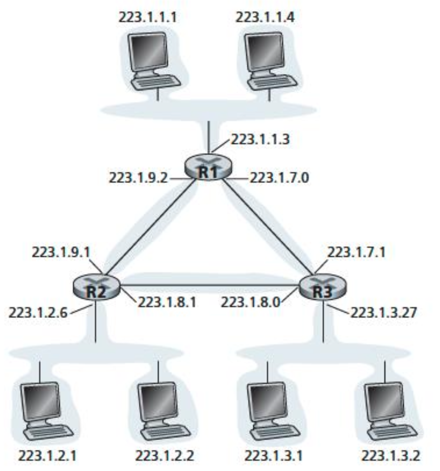
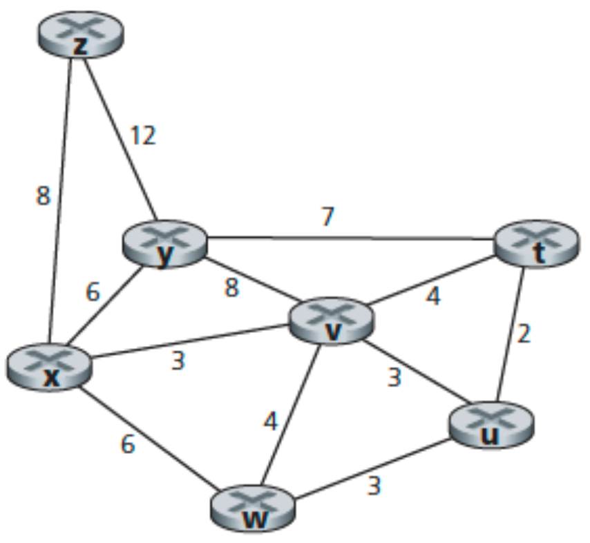

# Question 1
What are the source and destination port values in the segments flowing from the server back to the clients’ processes? What are the IP addresses in the network-layer datagrams carrying the transport-layer segments?


# Answer 1

**Host A Request:**
Source Port: 26145, Source IP: a, Destination Port: 80, Destination IP: b

**Server’s Response to Host A:**
Source Port: 80, Source IP: b, Destination Port: 26145, Destination IP: a

**Host C (Left Process) Request:**
Source Port: 7532, Source IP: c, Destination Port: 80, Destination IP: b

**Server’s Response to Host C (Left):**
Source Port: 80, Source IP: b, Destination Port: 7532, Destination IP: c

**Host C (Right Process) Request:**
Source Port: 26145, Source IP: c, Destination Port: 80, Destination IP: b

**Server’s Response to Host C (Right):**
Source Port: 80, Source IP: b, Destination Port: 26145, Destination IP: c

| Scenario                    | Source Port | Source IP  | Destination Port | Destination IP |
|-----------------------------|-------------|------------|------------------|----------------|
| **Host A → Server**         | 26145       | a          | 80               | b              |
| **Server → Host A**         | 80          | b          | 26145            | a              |
| **Host C (Left) → Server**  | 7532        | c          | 80               | b              |
| **Server → Host C (Left)**  | 80          | b          | 7532             | c              |
| **Host C (Right) → Server** | 26145       | c          | 80               | b              |
| **Server → Host C (Right)** | 80          | b          | 26145            | c              |


> **Importance of Demultiplexing:**
> On Host C, two different processes (left and right) are communicating with the same server (b), and both use the same server port (80). The operating system on Host C uses the destination port number (26145 vs. 7532) to correctly deliver incoming segments to the appropriate process. Since these port numbers are different, the segments are delivered to the correct sockets (and therefore to the correct processes).

# Question 2
UDP and TCP use 1s complement for their checksums. Suppose you have the following three 8-bit bytes: 01010011, 01100110, 01110100. What is the 1s complement of the sum of these 8-bit bytes? (Note that although UDP and TCP use 16-bit words in computing the checksum, for this problem you are being asked to consider 8-bit sums.) Show all work. Why is it that UDP takes the 1s complement of the sum; that is, why not just use the sum? With the 1s complement scheme, how does the receiver detect errors? Is it possible that a 1-bit error will go undetected? How about a 2-bit error?

# Answer 2


# Question 3
In protocol rdt3.0, the ACK packets flowing from the receiver to the sender do not have sequence numbers (although they do have an ACK field that contains the sequence number of the packet they are acknowledging). Why is it that our ACK packets do not require sequence numbers?

# Answer 3


# Question 4
Consider a channel that can lose packets but has a maximum delay that is known. Modify protocol rdt2.1 to include sender timeout and retransmit. Informally argue why your protocol can communicate correctly over this channel.

# Answer 4


# Question 5
Suppose Host A and Host B use a GBN protocol with window size N = 3 and a long-enough range of sequence numbers. Assume Host A sends six application messages to Host B and that all messages are correctly received, except for the first acknowledgment and the fifth data segment. Draw a timing diagram, showing the data segments and the acknowledgments sent along with the corresponding sequence and acknowledge numbers, respectively.

# Answer 5


# Question 6
Consider transferring an enormous file of L bytes from Host A to Host B.
Assume an MSS of 536 bytes.

**a.** What is the maximum value of L such that TCP sequence numbers are not exhausted? Recall that the TCP sequence number field has 4 bytes.
**b.** For the L you obtain in (a), find how long it takes to transmit the file. Assume that a total of 66 bytes of transport, network, and data-link header are added to each segment before the resulting packet is sent out over a 155 Mbps link. Ignore flow control and congestion control so A can pump out the segments back-to-back and continuously.

# Answer 6


# Question 7
Compare GBN, SR, and TCP (no delayed ACK). Assume that the timeout values for all three protocols are sufficiently long such that 5 consecutive data segments and their corresponding ACKs can be received (if not lost in the channel) by the receiving host (Host B) and the sending host (Host A) respectively. Suppose Host A sends 5 data segments to Host B, and the 2nd segment (sent from A) is lost. In the end, all 5 data segments have been correctly received by Host B.

**a.** How many segments has Host A sent in total and how many ACKs has Host B sent in total? What are their sequence numbers? Answer this question for all three protocols.
**b.** If the timeout values for all three protocol are much longer than 5 RTT, then which protocol successfully delivers all five data segments in shortest time interval?

# Answer 7


# Question 8
Consider a datagram network using 32-bit host addresses. Suppose a router has four links, numbered 0 through 3, and packets are to be forwarded to the link interfaces as follows:

```
Destination Address Range Link Interface            Link Interface

11100000 00000000 00000000 00000000
through                                                    0
11100000 00000000 11111111 11111111

11100000 00000001 00000000 00000000
through                                                    1
11100000 00000001 11111111 11111111

11100000 00000010 00000000 00000000
through                                                    2
11100001 11111111 11111111 11111111                    

otherwise                                                  3
```

**a.** Provide a forwarding table that has five entries, uses longest prefix matching, and forwards packets to the correct link interfaces.
**b.** Describe how your forwarding table determines the appropriate link interface for datagrams with destination addresses:

```
11111000 10010001 01010001 01010101

11100000 00000000 11000011 00111100

11100001 10000000 00010001 01110111
```

# Answer 8


# Question 9
Consider the topology shown in Figure. Denote the three subnets with hosts (starting clockwise at 12:00) as Networks A, B, and C. Denote the subnets without hosts as Networks D, E, and F.



**a.** Assign network addresses to each of these six subnets, with the following constraints: All addresses must be allocated from 214.97.254/23; Subnet A should have enough addresses to support 250 interfaces; Subnet B should have enough addresses to support 120 interfaces; and Subnet C should have enough addresses to support 120 interfaces. Of course, subnets D, E and F should each be able to support two interfaces. For each subnet, the assignment should take the form a.b.c.d/x or a.b.c.d/x – e.f.g.h/y.
**b.** Using your answer to part (a), provide the forwarding tables (using longest prefix matching) for each of the three routers.

# Answer 9


# Question 10
Consider the following network. With the indicated link costs, use Dijkstra’s shortest-path algorithm to compute the shortest path from x to all network nodes. Show how the algorithm works by computing a table.



# Answer 10
