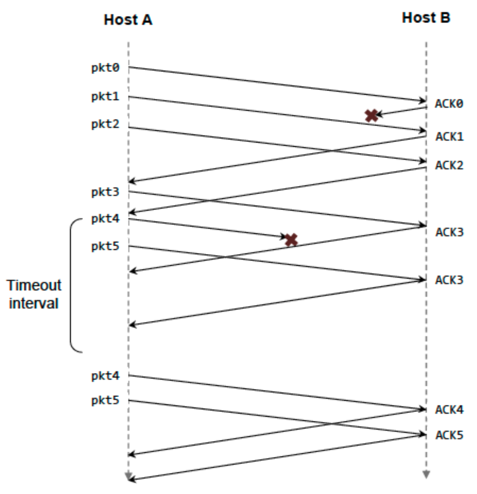
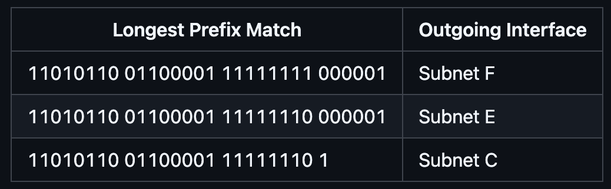

##### Question 1
What are the source and destination port values in the segments flowing from the server back to the clients’ processes? What are the IP addresses in the network-layer datagrams carrying the transport-layer segments?


##### Answer 1
**Host A Request:**
Source Port: 26145, Source IP: a, Destination Port: 80, Destination IP: b

**Server’s Response to Host A:**
Source Port: 80, Source IP: b, Destination Port: 26145, Destination IP: a

**Host C (Left Process) Request:**
Source Port: 7532, Source IP: c, Destination Port: 80, Destination IP: b

**Server’s Response to Host C (Left):**
Source Port: 80, Source IP: b, Destination Port: 7532, Destination IP: c

**Host C (Right Process) Request:**
Source Port: 26145, Source IP: c, Destination Port: 80, Destination IP: b

**Server’s Response to Host C (Right):**
Source Port: 80, Source IP: b, Destination Port: 26145, Destination IP: c

> **Importance of Demultiplexing:**
> On Host C, two different processes (left and right) are communicating with the same server (b), and both use the same server port (80). The operating system on Host C uses the destination port number (26145 vs. 7532) to correctly deliver incoming segments to the appropriate process. Since these port numbers are different, the segments are delivered to the correct sockets (and therefore to the correct processes).

##### Question 2
UDP and TCP use 1s complement for their checksums. Suppose you have the following three 8-bit bytes: 01010011, 01100110, 01110100. What is the 1s complement of the sum of these 8-bit bytes? (Note that although UDP and TCP use 16-bit words in computing the checksum, for this problem you are being asked to consider 8-bit sums.) Show all work. Why is it that UDP takes the 1s complement of the sum; that is, why not just use the sum? With the 1s complement scheme, how does the receiver detect errors? Is it possible that a 1-bit error will go undetected? How about a 2-bit error?

##### Answer 2
```
      0 1 0 1 0 0 1 1
    + 0 1 1 0 0 1 1 0
    -----------------
      1 0 1 1 1 0 0 1

      1 0 1 1 1 0 0 1
    + 0 1 1 1 0 1 0 0
    -----------------
      0 0 1 0 1 1 1 0
One’s complement = 1 1 0 1 0 0 0 1
```
To detect errors, the receiver adds the four words (the three original words and the checksum). If the sum contains a zero, the receiver knows there has been an error. All one-bit errors will be detected, but two-bit errors can be undetected (e.g., if the last digit of the first word is converted to a 0 and the last digit of the second word is converted to a 1).

##### Question 3
In protocol rdt3.0, the ACK packets flowing from the receiver to the sender do not have sequence numbers (although they do have an ACK field that contains the sequence number of the packet they are acknowledging). Why is it that our ACK packets do not require sequence numbers?

##### Answer 3
To best answer this question, consider why we needed sequence numbers in the first place. We saw that the sender needs sequence numbers so that the receiver can tell if a data packet is a duplicate of an already received data packet. In the case of ACKs, the sender does not need this info (i.e., a sequence number on an ACK) to tell detect a duplicate ACK. A duplicate ACK is obvious to the rdt3.0 receiver, since when it has received the original ACK it transitioned to the next state. The duplicate ACK is not the ACK that the sender needs and hence is ignored by the rdt3.0 sender

##### Question 4
Consider a channel that can lose packets but has a maximum delay that is known. Modify protocol rdt2.1 to include sender timeout and retransmit. Informally argue why your protocol can communicate correctly over this channel.

##### Answer 4
If the sending of this message were removed, the sending and receiving sides would deadlock, waiting for an event that would never occur. Here’s a scenario:
- Sender sends pkt0, enters the “Wait for ACK0” state, and waits for a packet back from the receiver.
- Receiver is in the “Wait for 0 from below” state, and receives a corrupted packet from the sender. Suppose it does not send anything back, and simply re-enters the “wait for 0 from below” state.
Now, the sender is awaiting an ACK of some sort from the receiver, and the receiver is waiting for a data packet from the sender — a deadlock!

##### Question 5
Suppose Host A and Host B use a GBN protocol with window size N = 3 and a long-enough range of sequence numbers. Assume Host A sends six application messages to Host B and that all messages are correctly received, except for the first acknowledgment and the fifth data segment. Draw a timing diagram, showing the data segments and the acknowledgments sent along with the corresponding sequence and acknowledge numbers, respectively.



##### Question 6
Consider transferring an enormous file of L bytes from Host A to Host B.
Assume an MSS of 536 bytes.
**a.** What is the maximum value of L such that TCP sequence numbers are not exhausted? Recall that the TCP sequence number field has 4 bytes.
**b.** For the L you obtain in (a), find how long it takes to transmit the file. Assume that a total of 66 bytes of transport, network, and data-link header are added to each segment before the resulting packet is sent out over a 155 Mbps link. Ignore flow control and congestion control so A can pump out the segments back-to-back and continuously.

There are $2^{32}$ = 4.294.967.296 possible sequence numbers.
**a.** The sequence number does not increment by one with each segment. Rather, it increments by the number of bytes of data sent. So the size of the MSS is irrelevant — the maximum size file that can be sent from A to B is simply the number of bytes representable by $2^{32}$ ≈ 4.19 Gbytes
**b.** The number of segments is $2^{32}$ / 536 = 8,012,999. 66 bytes of header get added to each segment, giving a total of **528,857,934 bytes** of header.  
The total number of bytes transmitted is $2^{32}$ + 528.857.934 = 4.824 x $10^{9}$
Thus, it would take **249 seconds** to transmit the file over a **155-Mbps** link.

##### Question 7
Compare GBN, SR, and TCP (no delayed ACK). Assume that the timeout values for all three protocols are sufficiently long such that 5 consecutive data segments and their corresponding ACKs can be received (if not lost in the channel) by the receiving host (Host B) and the sending host (Host A) respectively. Suppose Host A sends 5 data segments to Host B, and the 2nd segment (sent from A) is lost. In the end, all 5 data segments have been correctly received by Host B.
**a.** How many segments has Host A sent in total and how many ACKs has Host B sent in total? What are their sequence numbers? Answer this question for all three protocols.
**b.** If the timeout values for all three protocol are much longer than 5 RTT, then which protocol successfully delivers all five data segments in shortest time interval?

**a.** **GoBackN:**
A sends 9 segments in total. They are initially sent segments 1, 2, 3, 4, 5 and later re-sent segments 2, 3, 4, and 5.  
B sends 8 ACKs. They are 4 ACKs with sequence number 1, and 4 ACKs with sequence numbers 2, 3, 4, and 5.
**Selective Repeat:**
A sends 6 segments in total. They are initially sent segments 1, 2, 3, 4, 5 and later re-sent segment 2.  
B sends 5 ACKs. They are 4 ACKs with sequence number 1, 3, 4, 5. And there is one ACK with sequence number 2.
**TCP:**
A sends 6 segments in total. They are initially sent segments 1, 2, 3, 4, 5 and later re-sent segment 2.  
B sends 5 ACKs. They are 4 ACKs with sequence number 2. There is one ACK with sequence number 6.  
Note that TCP always sends an ACK with the expected sequence number.
**b.** TCP. This is because TCP uses fast retransmit without waiting until timeout.

##### Question 8
Consider a datagram network using 32-bit host addresses. Suppose a router has four links, numbered 0 through 3, and packets are to be forwarded to the link interfaces as follows:


**a.** Provide a forwarding table that has five entries, uses longest prefix matching, and forwards packets to the correct link interfaces.
**b.** Describe how your forwarding table determines the appropriate link interface for datagrams with destination addresses:
```
11111000 10010001 01010001 01010101

11100000 00000000 11000011 00111100

11100001 10000000 00010001 01110111
```
**a.**
| Prefix Match        | Link Interface |
|---------------------|----------------|
| 11100000 00000000   | 0              |
| 11100000 00000001   | 1              |
| 1110000             | 2              |
| 11100010            | 3              |
| otherwise           | 3              |

**b.**
Prefix match for first address is **5th entry**: link interface **3**  
Prefix match for second address is **1st entry**: link interface **0**  
Prefix match for third address is **4th entry**: link interface **2**

##### Question 9
Consider the topology shown in Figure. Denote the three subnets with hosts (starting clockwise at 12:00) as Networks A, B, and C. Denote the subnets without hosts as Networks D, E, and F.


**a.** Assign network addresses to each of these six subnets, with the following constraints: All addresses must be allocated from 214.97.254/23; Subnet A should have enough addresses to support 250 interfaces; Subnet B should have enough addresses to support 120 interfaces; and Subnet C should have enough addresses to support 120 interfaces. Of course, subnets D, E and F should each be able to support two interfaces. For each subnet, the assignment should take the form a.b.c.d/x or a.b.c.d/x – e.f.g.h/y.

**b.** Using your answer to part (a), provide the forwarding tables (using longest prefix matching) for each of the three routers.

From 214.97.254/23, possible assignments are
**a.**  
Subnet A: 214.97.255/24 (256 addresses)  
Subnet B: 214.97.254.0/25 – 214.97.254.0/29 (128 − 8 = 120 addresses)  
Subnet C: 214.97.254.128/25 (128 addresses)  
Subnet D: 214.97.254.0/31 (2 addresses)  
Subnet E: 214.97.254.2/31 (2 addresses)  
Subnet F: 214.97.254.4/30 (4 addresses)  

**b.**
To simplify the solution, assume that no datagrams have router interfaces as ultimate destinations. Also, label D, E, F for the upper-right, bottom, and upper-left interior subnets, respectively.

**Router 1**


**Router 2**


**Router 3**



##### Question 10
Consider the following network. With the indicated link costs, use Dijkstra’s shortest-path algorithm to compute the shortest path from x to all network nodes. Show how the algorithm works by computing a table.


##### Answer 10
