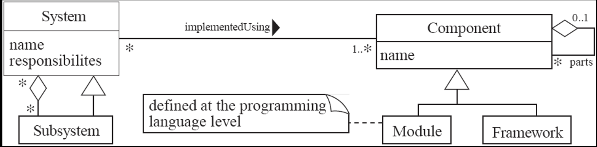
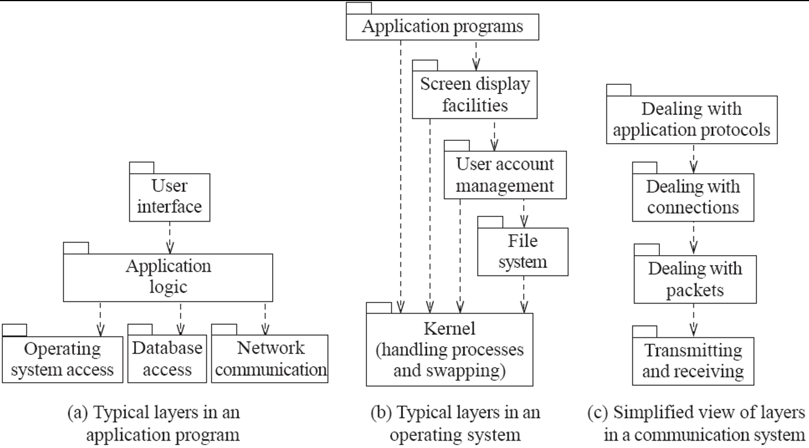

# CHAPTER 1

### THE NATURE OF SOFTWARE

- Software is intangible
  - Hard to understand development effort
- Software is easy to reproduce
  - Cost is in its development
    - In other engineering products, manufacturing is the costly stage
- The industry is labor-intensive

  - Hard to automate

- Untrained people can hack something together
  - Quality problems are hard to notice
- Software is easy to modify
  - People make changes without fully understanding it
- Software does not ‘wear out’
  - It deteriorates by having its design changed:
    - Erroneously, or
    - In ways that were not anticipated, thus making it complex

### SOFTWARE CRISIS

- Much software has poor design and is getting worse
- Many software projects are either never delivered, or are delivered late and over budget
- There is strong demand for new and changed software, which customers expect to be of high quality and to be produced rapidly.
- Are we in a perpetual ‘software crisis’???

### TYPES OF SOFTWARE

- Custom
  - For a specific customer
- Generic
  - Sold on open market
  - Often called
  - COTS (Commercial Off The Shelf)
- Shrink-wrapped

  - Built into hardware
  - Hard to change

- Real time software
  - E.g., control and monitoring systems
  - Must react immediately
  - Safety often a concern
- Data processing software
  - Used to run businesses
  - Accuracy and security of data are key
- Some software has both aspects

### WHAT IS SOFTWARE ENGINEERING

- The process of solving customers’ problems by the systematic development and evolution of large, high-quality software systems within cost, time and other constraints

- Other definitions:

  - IEEE: (1) the application of a systematic, disciplined, quantifiable approach to the development, operation, maintenance of software; that is, the application of engineering to software. (2) The study of approaches as in (1).
  - The Canadian Standards Association: The systematic activities involved in the design, implementation and testing of software to optimize its production and support.

- **Solving customers’ problems**

  - This is the goal of software engineering
  - Sometimes the solution is to buy, not build
  - Adding unnecessary features does not help solve the problem
  - Software engineers must communicate effectively to identify and understand the problem

- **Systematic development and evolution**

  - An engineering process involves applying well understood techniques in an organized and disciplined way
  - Many well-accepted practices have been formally standardized
    - e.g. by the IEEE or ISO
  - Most development work is evolution

- **Large, high quality software systems**

  - Software engineering techniques are needed because large systems cannot be completely understood by one person
  - Teamwork and co-ordination are required
  - **Key challenge**: Dividing up the work and ensuring that the parts of the system work properly together
  - The end-product must be of sufficient quality

- **Cost, time and other constraints**
  - Finite resources
  - The benefit must outweigh the cost
  - Others are competing to do the job cheaper and faster
  - Inaccurate estimates of cost and time have caused many project failures

### STAKEHOLDERS IN SOFTWARE ENGINEERING

1. Users

- Those who use the software

2. Customers

- Those who pay for the software

3. Software developers

- Requirement specialists
- Database specialists
- Programmers
- Configuration management specialists

4. Development Managers

> All four roles can be fulfilled by the same person

### SOFTWARE QUALITY

| Quality Attribute | Definition                                                                                                |
| ----------------- | --------------------------------------------------------------------------------------------------------- |
| Usability         | The ease with which users can learn the system and quickly accomplish their tasks.                        |
| Efficiency        | The ability of the system to perform its functions without wasting resources such as CPU time and memory. |
| Reliability       | The degree to which the system performs its required functions correctly without failure.                 |
| Maintainability   | The ease with which the system can be modified, fixed, or improved over time.                             |
| Reusability       | The extent to which system components can be reused in other projects without the need for reprogramming. |

### SHORT TERM VS LONG TERM QUALITY

| Short Term                                             | Long Term                                                    |
| ------------------------------------------------------ | ------------------------------------------------------------ |
| Does the software meet the customer’s immediate needs? | Maintainability                                              |
| Is it sufficiently efficient?                          | Customer’s future needs                                      |
| Can it handle the current volume of data?              | Scalability: Can the software handle larger volumes of data? |

### SOFTWARE ENGINEERING PROJECTS

- Most projects are evolutionary or maintenance projects, involving work on _legacy_ systems
- <u>Corrective projects:</u> fixing defects
- <u>Adaptive projects:</u> changing the system in response to changes in
  - Operating system
  - Database
  - Rules and regulations
- <u>Enhancement projects:</u> adding new features for users
- <u>Reengineering or perfective projects:</u> changing the system internally so it is more maintainable

| Green Field Projects                                 | Brown Field Projects                                             |
| ---------------------------------------------------- | ---------------------------------------------------------------- |
| New development                                      | Development of new software on top of existing (legacy) software |
| Significantly less common than evolutionary projects | Rebuilding a system from an existing project                     |

- Projects that involve building on a framework or a set of
  existing components.
  - A framework is an application that is missing some important details
    - E.g., Specific rules of this organization
- Such projects:
  - Involve plugging together components that are:
    - Already developed
    - Provide significant functionality
  - Benefit from reusing reliable software
  - Provide much of the same freedom to innovate found in green field development

# CHAPTER 2

### Why do we use Object Oriented Programming?

- OOP is a programming paradigm based on the concept of _objects_ that contain data and methods.
- It increases flexibility and maintainability of programs.
- It brings together data and its behavior (methods) in a single location (object).
- OOP makes easier to understand how a program works.

## OBJECT

- Object is a bundle of data and its behavior (often known as methods).
- An object performs an operation when it receives a request (or message) from a client.
- Objects have two characteristics: states and behaviors.
- Objects are instances of classes.

**Example:**

```java
class House {
    string address:
    string color:
    double area:
    int numberOfRooms:
    void openDoor() {
    }
    void closeDoor() {
    }
}
```

```
House houseObject = new House();

[ object ]  --------------------->  [ class ]
```

### Characteristics of Objects

| Characteristic  | Definition                                                                                                             |
| --------------- | ---------------------------------------------------------------------------------------------------------------------- |
| Abstraction     | A process of showing only the relevant data of an object while hiding unnecessary details from the user.               |
| Encapsulation   | The concept of binding an object's state (fields) and behavior (methods) together into a single unit.                  |
| Message Passing | One object interacts with another object by invoking methods on that object. It is also referred as Method Invocation. |

## CLASS

- Can be considered as blueprint using which you can create as many objects as you like.
- Classes have data members (also known as fields, instance variables and object states).

```java
public class Website {

    // fields (or instance variable)
    String webName;
    int webAge;

    // constructor
    Website(String name, int age){
        this.webName = name;
        this.webAge = age;
    }

    public static void main(String args[]){

        // Creating objects
        Website obj1 = new Website("beginnersbook", 5);
        Website obj2 = new Website("google", 18);

        // Accessing object data through reference
        System.out.println(obj1.webName + " " + obj1.webAge);
        System.out.println(obj2.webName + " " + obj2.webAge);
    }
}
```

## CONSTRUCTOR

- It looks like a method, but it is not a method.
- In Java, there is always a constructor with empty parameters for each class.
- Its name is same as class name.
- It does not return any value.
- Can take one or more parameters.

```java
myClass myObject = new myClass();
```

### Object Implementation

```
+------------------------+
|      ClassName         |
+------------------------+
| Operation1()           |
| Type Operation2()      |
| ...                    |
+------------------------+
| instanceVariable1      |
| Type instanceVariable2 |
| ...                    |
+------------------------+
```

- A class defines the object’s
  - internal data
  - representation
  - operations
- An object is an instance of a class.

```
[ Instantiator ]  - - - - - - - - - - >  [ Instantiatee ]
```

### Type

- An object is said to have the type C if it accepts all requests for the operations defined in the interface named C.
- An object may have many types.
- Widely different objects can share a type.
- A type is a subtype of another if its interface contains the interface of its super type.
  - A subtype inherits the interface of its super type.

### Access Specifiers

| Access Specifier | Accessible From           | Description                                                                                |
| ---------------- | ------------------------- | ------------------------------------------------------------------------------------------ |
| `public`         | Everywhere                | Members are accessible from any other class or object.                                     |
| `private`        | Same class only           | Members can be accessed only by methods within the class where they are declared.          |
| `protected`      | Same class and subclasses | Members are accessible within the declaring class and its subclasses.                      |
| `default`        | Same package              | Members are accessible only within the same package when no access specifier is specified. |

### Subclassing

- Inheritance:
  - Subclass inherits all the definitions (data and operations) of the super class. (mod. visibility)
- Subclasses can refine and redefine behaviors of their parent classes.
  - A subclass may override an operation defined by its parent class.
  - Overriding gives subclasses a chance to handle requests instead of their parent classes.

```
+--------------+
| ParentClass  |
+--------------+
| Operation()  |
+--------------+
       ▲
       |
+--------------+
|  Subclass    |
+--------------+
```

### Abstract Class

- An abstract class defines a common interface for its subclasses.
- Defers some or all implementation to operations defined in subclasses
  - abstract operations
- Cannot be instantiated.
- Classes that aren't abstract are called concrete classes.

**Example:**

```java
abstract class MyAbstractClass {
    abstract void myMethod();
    void anotherMethod() {
    }
}
```

```
+----------------------+
|   AbstractClass      |
+----------------------+
| Operation()          |
+----------------------+
          ▲
          |
+----------------------+
|  ConcreteSubclass    |
+----------------------+                                 +-----------------------------+
| Operation() * - - - -| - - - - - - - - - - - - - - - > | Implementation pseudocode   |
+----------------------+                                 +-----------------------------+
```

### Abstract Class and Methods in OOPs Concepts

| Abstract                                                                                                 | Not Abstract                |
| -------------------------------------------------------------------------------------------------------- | --------------------------- |
| A method that is declared but not defined. Only method signature, no body.                               | Constructors                |
| Declared using the `abstract` keyword.                                                                   | Static methods              |
| Forces subclasses to provide implementations of the abstract methods or be declared abstract themselves. | Private methods             |
| Used to define a contract for subclasses.                                                                | Methods declared as `final` |

> If a child does not implement all the abstract methods of parent class (the abstract class), the child class must need to be declared abstract.

**Example:**

```java
// abstract class
abstract class Animal {
    // abstract method
    public abstract void animalSound();
}

public class Dog extends Animal {

    public void animalSound() {
        System.out.println("Woof");
    }

    public static void main(String args[]) {
        Animal obj = new Dog();
        obj.animalSound();
    }
}
```

- In this example we have an abstract class Animal that has an abstract method `animalSound()`:
  - Since the animal sound differs from one animal to another, there is no point in giving the implementation to this method as every child class must override this method to give its own implementation details.
- Now each animal must have a sound, by making this method abstract we made it compulsory to the child class to give implementation details to this method. This way we ensures that every animal has a sound.

### Abstract Class Declaration

```java
// abstract parent class
abstract class Animal {
    // abstract method
    public abstract void sound();
}

// Dog class extends Animal class
public class Dog extends Animal {

    public void sound() {
        System.out.println("Woof");
    }

    public static void main(String args[]) {
        Animal obj = new Dog();
        obj.sound();
    }
}
```

Hence for such kind of scenarios we generally declare the class as abstract and later concrete classes extend these classes and override the methods accordingly and can have their own methods as well.

```java
abstract class MyAbstractClass {
    abstract void myMethod();
    void anotherMethod() {
    }
}
```

**Rules:**

**Note 1:** As we seen in the above example, there are cases when it is difficult or often unnecessary to implement all the methods in parent class. In these cases, we can declare the parent class as abstract, which makes it a special class which is not complete on its own. MyAbstractClass class derived from the abstract class must implement all those methods that are declared as abstract in the parent class.

**Note 2:** Abstract class cannot be instantiated which means you cannot create the object of it. To use this class, you need to create another class that extends this this class and provides the implementation of abstract methods, then you can use the object of that child class to call non-abstract methods of parent class as well as implemented methods (those that were abstract in parent but implemented in child class).

**Note 3:** If a child does not implement all the abstract methods of abstract parent class, then the child class must need to be declared abstract as well.

### Why can’t we create the object of an abstract class?

```java
abstract class AbstractDemo {

    public void myMethod() {
        System.out.println("Hello");
    }

    abstract public void anotherMethod();
}

public class Demo extends AbstractDemo {

    public void anotherMethod() {
        System.out.print("Abstract method");
    }

    public static void main(String args[]) {

        // error: You can't create object of it
        AbstractDemo obj = new AbstractDemo();
        obj.anotherMethod();
    }
}
```

**Output:**

```
Unresolved compilation problem: Cannot instantiate the type AbstractDemo
```

- Abstract Classes have abstract methods that have no body so if Java allows you to create object of this class then if someone calls the abstract method using that object then what would happen?
  - There would be no actual implementation of the method to invoke. Since an object is concrete but an abstract class is like a template, so you should extend it before you can use it.

### Abstract Class vs Concrete Class

| Abstract Class                                                                                                                         | Concrete Class                                                           |
| -------------------------------------------------------------------------------------------------------------------------------------- | ------------------------------------------------------------------------ |
| An abstract class has no use until unless it is extended by some other class.                                                          | A class which is not abstract is referred as Concrete Class.             |
| If you declare an abstract method in a class, then you must declare the class abstract as well.                                        | You can’t have an abstract method in a concrete class.                   |
| It’s not always true that an abstract class must have abstract methods; a class without abstract methods can still be marked abstract. | A concrete class cannot be abstract and cannot contain abstract methods. |
| Abstract classes can have non-abstract (concrete) methods as well.                                                                     | All methods in a concrete class must have implementations.               |
| Abstract methods have no body and end with a semicolon (;).                                                                            | Methods in a concrete class always have a body.                          |
| An abstract class must be extended and its abstract methods must be overridden.                                                        | A concrete class can be instantiated directly.                           |
| A class must be declared abstract to have abstract methods.                                                                            | A concrete class cannot declare abstract methods.                        |

**Example:**

```java
abstract class MyClass {

    public void disp() {
        System.out.println("Concrete method of parent class");
    }

    abstract public void disp2();
}

class Demo extends MyClass {

    /* Must Override this method while extending
       MyClass
    */

    public void disp2() {
        System.out.println("overriding abstract method");
    }

    public static void main(String args[]) {
        Demo obj = new Demo();
        obj.disp2();
    }
}
```

**Output:**

```
overriding abstract method
```

### Super Keyword

- The super keyword refers to the objects of immediate parent class.
- The use of super keyword
  - To access the data members of parent class when both parent and child class have member with same name.
  - To explicitly call the no-arg and parameterized constructor of parent class.
  - To access the method of parent class when child class has overridden that method.

#### How to use super keyword to access the variables of parent class?

When you have a variable in child class which is already present in the parent class then in order to access the variable of parent class, you need to use the super keyword.

```java
// Parent class or Superclass or base class
class Superclass {
    int num = 100;
}

// Child class or subclass or derived class
class Subclass extends Superclass {

    /* The same variable num is declared in the Subclass
       which is already present in the Superclass
    */

    int num = 110;

    void printNumber() {
        System.out.println(num);
    }

    public static void main(String args[]) {
        Subclass obj = new Subclass();
        obj.printNumber();
    }
}
```

#### Use of super keyword to invoke constructor of parent class

- When we create the object of subclass, the new keyword invokes the constructor of child class, which implicitly invokes the constructor of parent class. So the order to execution when we create the object of child class is:
  - parent class constructor is executed first and then the child class constructor is executed. It happens because compiler itself adds super() (this invokes the no-arg constructor of parent class) as the first statement in the constructor of child class.

**Subclass:**

```java
class Subclass extends Parentclass {

    Subclass() {
        System.out.println("Constructor of child class");
    }

    Subclass(int num) {
        System.out.println("arg constructor of child class");
    }

    void display() {
        System.out.println("Hello!");
    }

    public static void main(String args[]) {

        Subclass obj = new Subclass();
        // Calling sub class method
        obj.display();

        Subclass obj2 = new Subclass(10);
        obj2.display();
    }
}
```

**Parent:**

```java
class Parentclass {

    Parentclass() {
        System.out.println("Constructor of parent class");
    }
}
```

**Output:**

```
Constructor of parent class
Constructor of child class
Hello!
Constructor of parent class
arg constructor of child class
Hello!
```

### How to use super keyword in case of method overriding?

- When a child class declares a same method which is already present in the parent class then this is called method overriding.
- When a child class overrides a method of parent class, then the call to the method from child class object always call the child class version of the method.
- However by using super keyword like this: super.method_name you can call the method of parent class (the method is overridden).
- In case of method overriding, the terminologies are used:
  - Overridden method: The method of parent class
  - Overriding method: The method of child class

```java
class Parentclass {

    // Overridden method
    void display() {
        System.out.println("Parent class method");
    }
}

class Subclass extends Parentclass {

    // Overriding method
    void display() {
        System.out.println("Child class method");
    }

    void printMsg() {
        // This would call Overriding method
        display();

        // This would call Overridden method
        super.display();
    }

    public static void main(String args[]) {
        Subclass obj = new Subclass();
        obj.printMsg();
    }
}
```

**Output:**

```
Child class method
Parent class method
```

What if the child class is not overriding any method: No need of super When child class doesn’t override the parent class method then we don’t need to use the super keyword to call the parent class method. This is because in this case we have only one version of each method and child class has access to the parent class methods so we can directly call the methods of parent class without using super.

```java
class Parentclass {

    void display() {
        System.out.println("Parent class method");
    }
}

class Subclass extends Parentclass {

    void printMsg() {

        /* This would call method of parent class,
           no need to use super keyword because no other
           method with the same name is present in this class
        */

        display();
    }

    public static void main(String args[]) {
        Subclass obj = new Subclass();
        obj.printMsg();
    }
}
```

**Output:**

```
Parent class method
```

## INTERFACE

- Every operation declared by an object specifies the operation's name, the objects it takes as parameters, and the operation's return value.
- This is known as the operation's signature.
- The set of all signatures defined by an object's operations is called the interface to the object.
- An object's interface says nothing about its implementation—different objects are free to implement requests differently.
- All methods in an interface are implicitly public and abstract. Using the keyword abstract before each method is optional.
- An interface may contain final variables.
- A class can extend only one other class, but it can implement any number of interfaces.
- When a class implements an interface it must give the definition of all the abstract methods of interface, else it can be declared as abstract class.
- An interface reference can point to objects of its implementing classes.

**Example:**

```
+------------------------------------+         +--------------------------------------------------+
| Class MathTeacher extends Teacher  |         | Class Teacher {                                  |
| implements Mathematician {         |         |     private String tname;                        |
|                                    |         |     private double tsalary;                      |
|     public void solveMathProb() {  |-------->|     private String mainsubject;                  |
|         ...                        |         |                                                  |
|     }                              |         |     public String getName() {                    |
| }                                  |         |         return this.tname;                       |
+------------------------------------+         |     }                                            |
                 ▲                             |                                                  |
                 |                             |     public String setName(String value) {        |
                 |                             |         this.tname = value;                      |
   +-----------------------------+             |     }                                            |
   | Interface Mathematician {   |             |                                                  |
   |     String expertiseInMath; |             |     // getter setter for salary and subject      |
   |     void solveMathProb();   |             |     ....                                         |
   | }                           |             | }                                                |
   +-----------------------------+             +--------------------------------------------------+
```

Example of class implements an interface:

```java
interface MyInterface {

    /* compiler will treat them as:
     * public abstract void method1();
     * public abstract void method2();
     */

    public void method1();
    public void method2();
}

class Demo implements MyInterface {

    /* This class must have to implement both the abstract methods
     * else you will get compilation error
     */

    public void method1() {
        System.out.println("implementation of method1");
    }

    public void method2() {
        System.out.println("implementation of method2");
    }

    public static void main(String arg[]) {
        MyInterface obj = new Demo();
        obj.method1();
    }
}
```

### Interface and Inheritance

- Interfaces can extend the other interfaces.
- Inf2 extends Inf1 so If class implements the Inf2 it must provide implementation of all the methods
  of interfaces Inf2 as well as Inf1.

```java
interface Inf1 {
    public void method1();
}

interface Inf2 extends Inf1 {
    public void method2();
}

public class Demo implements Inf2 {

    /* Even though this class is only implementing the
     * interface Inf2, it has to implement all the methods
     * of Inf1 as well because the interface Inf2 extends Inf1
     */

    public void method1() {
        System.out.println("method1");
    }

    public void method2() {
        System.out.println("method2");
    }

    public static void main(String args[]) {
        Inf2 obj = new Demo();
        obj.method2();
    }
}
```

#### Generalization and Specialization

- In order to implement the concept of inheritance, one must first identify the similarities among different classes to produce the base class.
- This process of identifying the similarities among different classes is called Generalization.
  - Generalization is the process of extracting shared characteristics from two or more classes and combining them into a generalized superclass.
  - Shared characteristics can be attributes or methods.
- In contrast to generalization, specialization means creating new subclasses from an existing class.
  - If it turns out that certain attributes or methods only apply to some of the objects of the class, a subclass can be created.

### Object Oriented Programming Features

- Abstraction
- Encapsulation
- Inheritance
- Polymorphism

#### Abstraction

- Show only relevant data and hide unnecessary details of an object from the user.
- For example, when you login to your bank account online,
  - you enter your user id and password and press login,
  - what happens when you press login,
  - how the input data sent to server,
  - how it gets verified is all abstracted away from you.

#### Encapsulation

- Requests are the only way to get an object to execute an operation.
- Operations are the only way to change an object's internal data.
- Because of these restrictions, the object's internal state is said to be encapsulated.
  - it cannot be accessed directly
  - its representation is invisible from outside the object.
- Objects are known only through their interfaces.
- It means binding object state (fields) and behavior (methods) together.
- Benefits of encapsulation
  - If you want to change the implementation details of the class, you can freely do so without affecting the classes that are using it.
  - Make the instance variables private so that they can not be accessed directly from outside the class.
  - get and set methods in the class to set and get the values of the fields.

```java
class EmployeeCount {

    private int numOfEmployees = 0;

    public void setNoOfEmployees(int count) {
        numOfEmployees = count;
    }

    public double getNoOfEmployees() {
        return numOfEmployees;
    }
}

public class EncapsulationExample {

    public static void main(String args[]) {
        EmployeeCount obj = new EmployeeCount();
        obj.setNoOfEmployees(5613);
        System.out.println("No Of Employees: " + (int) obj.getNoOfEmployees());
    }
}
```

#### Inheritance

➕ Straightforward
➕ Easy to modify the implementation being reused
➖ Can’t change the implementation dynamically
➖ “breaks encapsulation”: super class is exposed to subclass; changing super class likely to force a change in subclasses

- If two or more classes have common data members and methods, we can use inheritance.
- There is an is-a relationship for inheritance.
- MathTeacher object can use data members and methods of the Teacher class.

```java
class Teacher {

    String designation = "Teacher";
    String college = "Beginnersbook";

    void does() {
        System.out.println("Teaching");
    }
}

public class MathTeacher extends Teacher {

    String mainSubject = "Maths";

    public static void main(String args[]) {
        MathTeacher obj = new MathTeacher();

        System.out.println(obj.college);
        System.out.println(obj.designation);
        System.out.println(obj.mainSubject);
        obj.does();
    }
}
```

```
+-----------------+
|  CollegeStaff   |
+-----------------+
         |
         v               +----------------+     +------------------+
+-----------------+      |     Teacher    |     |  Mathematician   |
|    Teachers     |      +----------------+     +------------------+
+-----------------+                \               /
         |                          \             /
         v                           v           v
+-----------------+                +---------------+
|  MathTeacher    |                |  MathTeacher  |
+-----------------+                +---------------+

✓ VALID INHERITANCE                 ✗ INVALID DESIGN
```

| Type of Inheritance          | Description                                                                                                                                                                |
| ---------------------------- | -------------------------------------------------------------------------------------------------------------------------------------------------------------------------- |
| **Single Inheritance**       | Refers to a child and parent class relationship where a class extends another class.                                                                                       |
| **Multilevel Inheritance**   | Refers to a child and parent class relationship where a class extends another child class. For example, class A extends class B and class B extends class C.               |
| **Hierarchical Inheritance** | Refers to a child and parent class relationship where more than one class extends the same parent class. For example, class B extends class A and class C extends class A. |
| **Multiple Inheritance**     | Refers to a concept of one class extending more than one class, meaning a child class has two parent classes. **Java does not support multiple inheritance.**              |

#### Polymorphism

- Issuing a request doesn't commit you to a specific implementation until runtime.
- **Polymorphism**: being able to substitute objects that have identical interfaces for each other at run-time.
- Lets objects vary their relationships to each other at run-time.

- Polymorphism is an object-oriented programming feature that allows us to perform a single action in different ways.
- Let’s say we have a class `Animal` that has a method `animalSound()`, here we can not give implementation to this method as we do not know which `Animal` class would extend `Animal` class. So, we make this method abstract like below. Now suppose we have two `Animal` classes `Dog` and `Lion` that extends `Animal` class.

```java
public abstract class Animal {

    public abstract void animalSound();

}
```

```java
public class Lion extends Animal {

    @Override
    public void animalSound() {
        System.out.println("Roar");
    }

}
```

```java
public class Dog extends Animal {

    @Override
    public void animalSound() {
        System.out.println("Woof");
    }

}
```

#### Program to an Interface, not an Implementation

- Two benefits
  - Clients remain unaware of the specific types of objects they use, as long as the objects adhere to the interface that clients expect.
  - Clients remain unaware of the classes that implement these objects.
- Greatly reduce implementation dependence
- Declare/commit to variables via interfaces.
- Use creational patterns
  - Abstract out object creation
  - Associate an interface with its implementation transparently

#### Reuse Mechanisms

- (Class) Inheritance
  - White-box reuse
- Composition
  - Black-box reuse
  - Must have well-defined interfaces

# CHAPTER 3

### The Process of Design

- Design is a problem-solving process whose objective is to find and describe a way:
  - To implement the system’s functional requirements...
  - While respecting the constraints imposed by the quality, platform and process requirements...
    - including the budget
  - And while adhering to general principles of good quality

### Design as a Series of Decisions

- A designer is faced with a series of design issues
  - These are sub-problems of the overall design problem.
  - Each issue normally has several alternative solutions:
    - design options.
  - The designer makes a design decision to resolve each issue.
    - This process involves choosing the best option from among the alternatives

### Making Decisions

- To make each design decision, the software engineer uses the knowledge of
  - the requirements
  - the design as created so far
  - the technology available
  - software design principles and ‘best practices’
  - what has worked well in the past

### Design Space

The space of possible designs that could be achieved by choosing different sets of alternatives is often called the design space


### Component

- Any piece of software or hardware that has a clear role
  - A component can be isolated, allowing you to replace it with a different component that has equivalent functionality
  - E.g., frameworks, source code files, executables, DLLs, and databases
  - Many components are designed to be reusable
  - Conversely, others perform special-purpose functions

### Module

- A component that is defined at the programming language level
  - For example, methods, classes and packages are modules in Java

### System

- A logical entity, having a set of definable responsibilities or objectives, and consisting of hardware, software or both
  - A system can have a specification which is then implemented by a collection of components
  - A system continues to exist, even if its components are changed or replaced
  - The goal of requirements analysis is to determine the responsibilities of a system

### Subsystem

A system that is part of a larger system, and which has a definite interface

### UML diagram of system parts



### Top-Down and Bottom-Up Design

- Top-down design
  - First design the very high level structure of the system
  - Then gradually work down to detailed decisions about low-level constructs
  - Finally arrive at detailed decisions such as:
    - the format of particular data items;
    - the individual algorithms that will be used
- Bottom-up design
  - Make decisions about reusable low-level utilities.
  - Then decide how these will be put together to create high-level constructs.

| Top-down design                                                          | Bottom-up design                                                                                         |
| ------------------------------------------------------------------------ | -------------------------------------------------------------------------------------------------------- |
| Emphasis is on planning and complete understanding of the system.        | Emphasis is on coding and early testing, which can begin as soon as the first module has been specified. |
| No coding can begin until a sufficient level of detail has been reached. | Re-usability of code is one of the main benefits.                                                        |
| —                                                                        | Since the big picture is missing, you may not always build a system from the pieces you’ve started.      |

- A mix of top-down and bottom-up approaches are normally used
  - Top-down design is almost always needed to give the system a good structure
  - Bottom-up design is normally useful so that reusable components can be created

### Different Aspects of Design

- Architecture design:
  - The division into subsystems and components,
  - How these will be connected
  - How they will interact
  - Their interfaces
- Class design
  - The various features of classes
- User interface design
- Algorithm design
  - The design of computational mechanisms
- Protocol design:
  - The design of communications protocol.

### Principles Leading to Good Design

- Overall goals of good design:
  - Increasing profit by reducing cost and increasing revenue
  - Ensuring that we actually conform with the requirements
  - Accelerating development
  - Increasing qualities such as
    - Usability
    - Efficiency
    - Reliability
    - Maintainability
    - Reusability

### Design Principle 1: Divide and conquer

- Trying to deal with something big all at once is normally much harder than dealing with a series of smaller things
  - Separate people can work on each part
  - An individual software engineer can specialize
  - Each individual component is smaller, and therefore easier to understand
  - Parts can be replaced or changed without having to replace or extensively change other parts

#### Ways of Dividing a Software System

- A distributed system is divided up into clients and servers
- A system is divided up into subsystems
- A subsystem can be divided up into one or more packages
- A package is divided up into classes
- A class is divided up into methods

### Design Principle 2: Increase Cohesion Where Possible

- A subsystem or module has high cohesion if it keeps together things that are related to each other, and keeps out other things
- This makes the system as a whole easier to understand and change
- Type of cohesion:
  - Functional
  - Layer
  - Communicational
  - Sequential
  - Procedural
  - Temporal
  - Utility

#### Functional Cohesion

- This is achieved when all the code that computes a particular result is kept together - and everything else is kept out
  - i.e. when a module only performs a single computation, and returns a result, without having side-effects
- Examples of high cohesion
  - `sin()`
  - `getEmployeeName()`
  - `calcLoanPayment()`
  - `getIconLocation()`
- Examples of low cohesion
  - `getEmployeeNameAndChangeHerSalary()`
- Benefits to the system
  - Easier to understand
  - More reusable
  - Easier to replace
- Modules that update a database, create a new file or interact with the user are not functionally cohesive

#### Layer Cohesion

- All the facilities for providing or accessing a set of related services are kept together, and everything else is kept out
  - The layers should form a hierarchy
    - Higher layers can access services of lower layers,
    - Lower layers do not access higher layers
  - The set of procedures through which a layer provides its services is the application programming interface (API)
  - You can replace a layer without having any impact on the other layers
    - You just replicate the API

##### Example of The Use of Layers



### Communicational Cohesion

- All the modules that access or manipulate certain data are kept together (e.g. in the same class) - and everything else is kept out
  - A class would have good communicational cohesion
    - If all the system’s facilities for storing and manipulating its data are contained in this class.
    - If the class does not do anything other than manage its data.
  - Main advantage: When you need to make changes to the data, you find all the code in one place

#### Sequential Cohesion

- Procedures, in which one procedure provides input to the next, are kept together – and everything else is kept out
  - You should achieve sequential cohesion, only once you have already achieved the preceding types of cohesion

```java
    public void processFile(){
        File f = openFile();
        Content c = f.readFile();
        Result r = c.makeComputations();
        r.print();
           f.closeFile();
    }
```

#### Procedural Cohesion

- Procedures that are used one after another are kept together
  - Even if one does not necessarily provide input to the next
  - Weaker than sequential cohesion

```java
    public void  printSomething(){
        printRevenueReport();
        printExpenseReport();
        printEmployeePhoneNumbers();
        printInvitations();
    }
```

#### Temporal Cohesion

- Operations that are performed during the same phase of the execution of the program are kept together, and everything else is kept out
  - For example, placing together the code used during system start-up or initialization
  - Weaker than procedural cohesion

```java
    public void initialize(){
        Module mode1, model2, model3;
        …
        module1.initialize();
        module2.initialize();
        module3.initialize();
    }
```

#### Utility Cohesion

- Related utilities which cannot be logically placed in other cohesive units are kept together
  - A utility is a procedure or class that has wide applicability to many different subsystems and is designed to be reusable
  - For example, the `java.lang.Math` class

### Design Principle 3: Reduce Coupling Where Possible

- Coupling occurs when there are interdependencies between one module and another (complement of cohesion)
  - The more tightly coupled a set of modules is, the harder it is to understand
  - A network of interdependencies makes it hard to see at a glance how some component works.
  - When interdependencies exist, changes in one place will require changes somewhere else.
  - Type of coupling:
    - Content
    - Common
    - Control
    - Stamp
    - Data
    - Routine Call
    - Type use
    - Inclusion/Import
    - External

#### Content Coupling

- Occurs when one component surreptitiously modifies data that is internal to another component
  - To reduce content coupling you should therefore encapsulate all instance variables
    - Declare them private
    - Provide get and set methods
  - A worse form of content coupling occurs when you directly modify an instance variable of an instance variable

#### Common Coupling

- Occurs whenever you use a global variable
  - All the components using the global variable become coupled to each other
  - A weaker form of common coupling is when a variable can be accessed by a subset of the system’s classes
    - e.g. a Java package
  - Can be acceptable for creating global variables that represent system-wide default values
  - The Singleton pattern provides encapsulated global access to an object

#### Control Coupling

- Occurs when one procedure calls another using a ‘flag’ or ‘command’ that explicitly controls what the second procedure does
  - To make a change you have to change both the calling and called method
  - The use of polymorphic operations is normally the best way to avoid control coupling
  - One way to reduce the control coupling could be to have a look-up table
    - commands are then mapped to a method that should be called when that command is issued

##### Example of Control Coupling

```java
    public routineX(String command){

    if (command.equals("drawCircle")
        drawCircle();

    else if (command.equals(“drawRectangle”))
        drawRectangle();

    else if (command.equals(“drawTriangle”))
        drawTriangle();
    }
```

#### Use Polymorphism Instead

```
                +------------------+
                |      Shape       |
                +------------------+
                | + draw()         |
                +------------------+
                        ▲
                        |
        -----------------------------------------
        |                    |                  |
+---------------+   +----------------+   +-------------+
|    Circle     |   |   Rectangle    |   |   Triangle  |
+---------------+   +----------------+   +-------------+
```

```java
    public routineX(String command){

    if (command.equals("drawCircle"))
        drawCircle();

    else if (command.equals(“drawRectangle”))
        drawRectangle();

    else if (command.equals(“drawTriangle”))
        drawTriangle();
    }
```

vs

```java
    public routineX(Shape s){
        s.draw();
    }
```

#### Data Coupling

- Occurs whenever the types of method arguments are either primitive or else simple library classes
  - The more arguments a method has, the higher the coupling
    - All methods that use the method must pass all the arguments
  - You should reduce coupling by not giving methods unnecessary arguments
  - There is a trade-off between data coupling and stamp coupling
    - Increasing one often decreases the other

#### Routine Call Coupling

- Occurs when one routine (or method in an object oriented system) calls another
  - The routines are coupled because they depend on each other’s behaviour
  - Routine call coupling is always present in any system.
  - If you repetitively use a sequence of two or more methods to compute something
    - then you can reduce routine call coupling by writing a single routine that encapsulates the sequence.

```java
    public void draw(Shape aShape){
        aShape.drawBackground();
        aShape.drawForeground();
        aShape.drawBorder();
    }
```

#### Type Use Coupling

- Occurs when a module uses a data type defined in another module
  - It occurs any time a class declares an instance variable or a local variable as having another class for its type
  - The consequence of type use coupling is that if the type definition changes, then the users of the type may have to change
  - Always declare the type of a variable to be the most general possible class or interface that contains the required operations

#### Inclusion or Import Coupling

- Occurs when one component imports a package (as in Java) or when one component includes another (as in C++)
- The including or importing component is now exposed to everything in the included or imported component
- If the included/imported component changes something or adds something
  - This may raises a conflict with something in the includer, forcing the includer to change
- An item in an imported component might have the same name as something you have already defined

#### External Coupling

- When a module has a dependency on such things as the operating system, shared libraries or the hardware
  - It is best to reduce the number of places in the code where such dependencies exist

### Design Principle 4: Keep The Level of Abstraction as High as Possible

- Ensure that your designs allow you to hide or defer consideration of details, thus reducing complexity
  - A good abstraction is said to provide information hiding
  - Abstractions allow you to understand the essence of a subsystem without having to know unnecessary details

#### Abstraction and Classes

- Classes are data abstractions that contain procedural abstractions
  - Abstraction is increased by defining all variables as private
  - The fewer public methods in a class, the better the abstraction
  - Superclasses and interfaces increase the level of abstraction
  - Attributes and associations are also data abstractions
  - Methods are procedural abstractions
    - Better abstractions are achieved by giving methods fewer parameters

### Design Principle 5: Increase Reusability Where Possible (Design for Reuse)

- Design the various aspects of your system so that they can be used again in other contexts
  - Generalize your design as much as possible
  - Follow the preceding three design principles
    - Increase cohesion -> well defined components
    - Reduce coupling -> stand alone components
    - Increase abstraction -> more general components

### Design Principle 6: Reuse Existing Designs and Code Where Possible (Design with Reuse)

- Design with reuse is complementary to design for reuse
  - Actively reusing designs or code allows you to take advantage of the investment you or others have made in reusable components
    - Cloning should not be seen as a form of reuse

### Design Principle 7: Design for Flexibility

- Actively anticipate changes that a design may have to undergo in the future, and prepare for them
  - Reduce coupling and increase cohesion
    - This allows you to more readily replace part of a system
  - Create abstractions
    - Create interfaces and super-classes with polymorphic methods
  - Do not hard-code anything
  - Use reusable code and make code reusable
    - For example, adding hooks tends to make designs more flexible

### Design Principle 8: Anticipate Obsolescence

- Plan for changes in the technology or environment so the software will continue to run or can be easily changed
  - Avoid using early releases of technology
  - Avoid using software libraries that are specific to particular environments
  - Avoid using undocumented features or little-used features of software libraries
  - Avoid using software or special hardware from companies that are less likely to provide long-term support
  - Use standard languages and technologies that are supported by multiple vendors

### Design Principle 9: Design For Portability

- Have the software run on as many platforms as possible
  - Avoid the use of facilities that are specific to one particular environment
    - E.g. a library only available in Microsoft Windows
  - Use standardizes interfaces as much as possible
    - E.g., The Portable Operating System Interface (POSIX) or POSIX threads (pthreads)

### Design Principle 10: Design for Testability

- Take steps to make testing easier
  - Design a program to automatically test the software
    - Ensure that all the functionality of the code can by driven by an external program, bypassing a graphical user interface

### Design Principle 11: Design Defensively

- Never trust how others will try to use a component you are designing
  - Handle all cases where other code might attempt to use your component inappropriately
  - Check that all of the inputs to your component are valid:
    - Unfortunately, over-zealous defensive design can result in unnecessarily repetitive checking

# CHAPTER 4

## OO Design Principles

- First of all, these are not strict laws, but rather guidelines or advice.
- They are mostly obtained through experience over time.
- Just knowing these principles does not automatically make you a good software engineer.
- Throughout this course, we will go through some well-known and widely used principles.

- Generic:
  - KISS
  - DRY
  - YAGNI
  - Separation of Concerns
  - Simplest Working Thing
  - Avoid Premature Optimization
  - Boy-Scout Rule
- Inter-Module
  - Minimize Coupling
  - Law of Demeter
  - Composition over Inheritance
  - Robustness Principle
  - Inversion of Control 
- Module
  - SOLID
    - Single Responsibility Principle
    - Open/Closed Principle
    - Liskov Substitution Principle
    - Interface Segregation Principle
    - Dependency Inversion Principle
  - Maximize Cohesion
  - Hide Implementation Details
  - Curly’s Law
  - Encapsulate What Changes
  - Command Query Separation

### Keep It Simple Stupid (KISS)

- Most systems work best if they are kept simple rather than made complex.
- **Why:**
  - Less code takes less time to write, has less bugs, and is easier to modify.
  - Simplicity is the ultimate sophistication.
  - It seems that perfection is reached not when there is nothing left to add, but when there is nothing left to take away.
- **How:**
  - Avoid inheritance, polymorphism, and other complicated OOP concepts unless necessary.
  - Avoid low-level optimization of algorithms
  - Avoid large code blocks

### Don't Repeat Yourself (DRY)

- Every piece of knowledge must have a single, unambiguous, authoritative representation within a system.
- Each significant piece of functionality in a program should be implemented in just one place in the source code.
- Why
  - Duplication (inadvertent or purposeful duplication) can lead to maintenance nightmares, poor factoring, and logical contradictions.
  - A modification of any single element of a system does not require a change in other logically unrelated elements.
  - Additionally, elements that are logically related all change predictably and uniformly and are thus kept in sync.
- How
  - Put business rules, long expressions, if statements, math formulas, metadata, etc. in only one place.
  - Where similar functions are carried out by distinct pieces of code, it is generally beneficial to combine them into one by abstracting out the varying parts.

### You Ain't Gonna Need It (YAGNI)

- Don't implement something until it is necessary.
- Why
  - Any work that's only used for a feature that's needed tomorrow, means losing effort from features that need to be done for the current iteration.
  - It leads to code bloat; the software becomes larger and more complicated.
- How
  - Always implement things when you need them, never when you just foresee that you need them.

### Separation of Concerns

- Separating a computer program into distinct sections, such that each section addresses a separate concern.
  - e.g. the business logic of the application is one concern and the user interface is another concern.
    - Changing the user interface should not require changes to business logic and vice versa.
- Why
  - Simplify development and maintenance of software applications.
  - When concerns are well-separated, individual sections can be reused, as well as developed and updated independently.
- How
  - Divide and conquer
    - Break program functionality into separate modules that overlap as little as possible

### Simplest Working Thing

- Why
  - Real progress against the real problem is maximized if we just work on what the problem really is.
- How
  - Ask yourself: "What is the simplest thing that could possibly work?"
  - First, implement a new capability in the simplest way you can think of that "could possibly work"
  - Second, and this is critical to the rule, refactor the system to be the simplest possible code including all the features it now has.

### Avoid Premature Optimization

- Don’t even think about optimization unless your code is working, but slower than you want. Only then should you start thinking about optimizing, and then only with the aid of empirical data.
- Understanding what is and isn’t "premature" is critical of course.
- Why
  - It is unknown upfront where the bottlenecks will be.
  - After optimization, it might be harder to read and thus maintain.
- How
  - Make It Work Make It Right Make It Fast
  - Don't optimize until you need to, and only after profiling you discover a bottleneck

> Programmers waste enormous amounts of time thinking about, or worrying about, the speed of noncritical parts of their programs, and these attempts at efficiency actually have a strong negative impact when debugging and maintenance are considered. We should forget about small efficiencies, say about 97% of the time: premature optimization is the root of all evil. Yet we should not pass up our opportunities in that critical 3%.
>
> Donald Knuth

### Boy-Scout Rule

- "Leave the campground cleaner than you found it". The boy-scout rule states that we should always leave the code cleaner than we found it.
- Why
  - When making changes to an existing codebase the code quality tends to degrade, accumulating technical debt.
  - Following the boy scout rule, we should mind the quality with each commit. Technical debt is resisted by continuous refactoring, no matter how small.
- How
  - With each commit make sure it does not degrade the codebase quality.
  - Any time someone sees some code that isn't as clear as it should be, they should take the opportunity to fix it right there and then.

### Minimize Coupling

- Coupling between modules/components is their degree of mutual interdependence; lower coupling is better.
- Why
  - Coupling is the probability that code unit "B" will "break" after an unknown change to code unit "A".
  - A change in one module usually forces a ripple effect of changes in other modules.
- How
  - Eliminate, minimize, and reduce complexity of necessary relationships.
  - By hiding implementation details, coupling is reduced.
  - Apply the Law of Demeter.

### Law of Demeter

- Governs the communication structure within an object-oriented design
- Principle of least knowledge → Don't talk to strangers!
- Why
  - It usually tightens coupling
  - It might reveal too much implementation details
- How
  - A method of an object may only call methods of:
    - The object itself.
    - An argument of the method.
    - Any object created within the method.
    - Any direct properties/fields of the object.
  - The law can be stated simply as "use only one dot".
    - the code a.b.Method() breaks the law where a.Method() does not.

### Composition over Inheritance

- The “composition over inheritance” principle states that objects with complex behaviors should do so by containing instances of objects with individual behaviors rather than inheriting a class and adding new behaviors.
- Class inheritance (“is-a” relationship) is a stronger form of coupling than composition (“uses-a” relationship).
- A class that offers its services primarily through public class inheritance (PCI) is basically saying “to use my services you can’t just hire me; you must become me”. That’s a strong commitment!
- Why
  - Less coupling between classes.
  - Using inheritance, subclasses easily make assumptions, and break LSP.
- How
  - Test for LSP (substitutability) to decide when to inherit.
  - Compose when there is a “has a” (or “uses a”) relationship, inherit when “is a”.

### Composition over Inheritance

```
               +----------------+
               |      Animal    |
               +----------------+
                ^              ^
                |              |
  +----------------+     +----------------+
  |   WaterAnimal  |     |  FlyingAnimal  |
  +----------------+     +----------------+
  | + swim()       |     | + fly()        |
  +----------------+     +----------------+
                                 ^
                                 |
                         +----------------+
                         |       Bird     |
                         +----------------+
                         | + walk()       |
                         | + fly()        |
                         +----------------+

               +------------------+
               |       Duck       |
               +------------------+
               | + swim()         |
               | + fly()          |
               +------------------+
```

- The inheritance hierarchy can become messy in the blink of an eye.
- Less flexibility for defining special-case behaviors, particularly when you want to implement behavior from one inheritance branch in another inheritance branch.
- Composition is a lot cleaner to write, easier to maintain, and allows for near-infinite flexibility as far as what kinds of behaviors you can define.
- Each individual behavior is its own class, and you create complex behaviors by combining individual behaviors.

```
+-----------------------------------------------+----------------------------------------------+
|            Inheritance (is-a)                 |             Composition (uses-a)             |
+-----------------------------------------------+----------------------------------------------+
|                             +-------------+   |   +-------------+    uses   +-------------+  |
|                             | super-class |   |   |  consumer   |  -------> |  front-end  |  |
|                             +-------------+   |   +-------------+           +-------------+  |
|                                     ▲         |                                    ▲         |
|                                     |         |                                    | 1       |
|  +-------------+    uses    +-------------+   |                             +-------------+  |
|  |  consumer   |  ------->  |  sub-class  |   |                             |  back-end   |  |
|  +-------------+            +-------------+   |                             +-------------+  |
+----------------------------------------------------------------------------------------------+
```

### Inversion of Control (IoC)

- Inversion of Control is also known as the Hollywood Principle, "Don't call us, we'll call you".
- It is a design principle in which custom-written portions of a computer program receive the flow of control from a generic framework.
- Inversion of control carries the strong implication that the reusable code and the problem-specific code are developed independently even though they operate together in an application.
- Why
  - Inversion of Control is used to increase modularity of the program and make it extensible.
  - To prevent side effects when replacing a module.
- How
  - Using Dependency Injection
  - Using Factory, Strategy, Template Method patterns

### Maximize Cohesion

- Cohesion of a single module/component is the degree to which its responsibilities form a meaningful unit; higher cohesion is better.
- Why
  - Increased difficulty in understanding modules.
  - Increased difficulty in maintaining a system, because logical changes in the domain affect multiple modules, and because changes in one module require changes in related modules.
  - Increased difficulty in reusing a module because most applications won’t need the random set of operations provided by a module.
- How
  - Group related functionalities sharing a single responsibility (e.g. in a class, module, etc.).

### Hide Implementation Details

- A software module hides information (i.e. implementation details) by providing an interface, and not leak any unnecessary information.
- Why
  - When the implementation changes, the interface clients are using does not have to change.
- How
  - Minimize accessibility of classes and members.
  - Don’t expose member data in public.
  - Avoid putting private implementation details into a class’s interface.
  - Decrease coupling to hide more implementation details.

### Curly’s Law

- Curly's Law is about choosing a single, clearly defined goal for any bit
  of code: Do One Thing.
- A variable should mean one thing, and one thing only.
- It should not mean one thing in one circumstance and carry a different value from a different domain some other time.
  - It should not mean two things at once.
  - It should mean One Thing and should mean it all the time.

### Encapsulate What Changes

- Encapsulate the concept that varies, i.e. a design is better when those parts that vary are encapsulated in a separate module.
- A good design identifies the hotspots that are most likely to change and encapsulates them behind an API.
- When an anticipated change then occurs, the modifications are kept local.
- Why
  - To minimize required modifications when a change occurs
- How
  - Encapsulate the concept that varies behind an API
  - Possibly separate the varying concept into its own module

### Incremental Development

- “Keep developing until you get it right”.
- Incremental development is based on agile methodology.
- Agile methods generally promote a disciplined project management process that encourages:
  - frequent inspection and adaptation,
  - a leadership philosophy that encourages teamwork,
  - self-organization and accountability,
  - a set of engineering best practices that allow for rapid delivery of high-quality software,
  - and a business approach that aligns development with customer needs and company goals.

### Design for Change

- Anticipate new requirements and changes to existing requirements
- Design for evolution
- Inflexible design risks major redesign in the future
  - Unanticipated changes are expensive
- Each design pattern ensures that a system can change in some specific ways.

### Common Causes of Redesign

- Creating an object by specifying a class explicitly
  - create objects indirectly.
- Dependence on specific operations.
  - avoid hard-coded requests
- Dependence on hardware and software platform.
  - abstract out dependences

# CHAPTER 5: CLEAN CODE
