# AGILE PROJECT MANAGEMENT METHODOLOGY

## Introduction to Agile Software Development

### What is Agile Software Development?

Agile Software Development is a category of software development methodologies that gained widespread popularity after the late 1990s. It is not a single rigid method but rather a collection of methods built upon common principles. Importantly, Agile represents a combination of old, new, and transformed ideas about how to build software effectively.

### Core Principles and Characteristics of Agile Methods

While there are different specific Agile methods (like Scrum and XP), they all share a set of common principles and practices. These include:

- Close collaboration with business experts or customers throughout the project, rather than just at the beginning.
- A strong preference for face-to-face communication within the team and with stakeholders to ensure clarity and rapid feedback.
- Frequent delivery of new, deployable business value in small, working increments, allowing for early and continuous feedback.
- The use of tight, self-organizing teams where members manage their own work and collaborate closely.
- A relentless focus on technical excellence and good design to maintain flexibility and quality over time.

### Goals of Agile Software Development

The overarching goal of Agile is to achieve iterative and incremental development of reliable software. This means building software in repeated cycles (iterations) that each add a small piece of functionality (increments). This approach aims to make the software resilient to changes and uncertainties in requirements, technology, or the market, which are inevitable in complex projects.

## Software Development Process and Quality

### The Fundamental Challenge

Building high-quality software is challenging due to two primary, often conflicting, factors:

1. Increasing size and complexity of software systems.
2. Strict constraints, such as limited budget (cost) and the pressure to release quickly (time-to-market).

These challenges directly impact key software quality attributes, which are the measurable characteristics of a good software product. The slides specifically highlight:

- **Reliability**: The software operates correctly and without failure.
- **Performance**: The software is efficient and responsive.
- **Maintainability**: The software is easy to modify, fix, and enhance over time.

### Improving Software Quality: Activities within the Process

To address these challenges and improve quality, several core activities are employed as part of the **software development process**:

- **Testing**: Executing the software to find defects.
- **Code and Design Reviews**: Systematic examination of code/design by peers to find errors and improve quality.
- **Quality Assurance (QA)**: A broader set of activities aimed at ensuring processes are followed and quality standards are met.
- **Monitor, Evaluate, and Take Corrective Actions**: Continuously tracking project metrics and making adjustments.
- **Defect Prevention**: Proactively changing the process to stop defects from being created in the first place.
- **Eliminating Root Causes of Defects**: Analyzing found defects to fix the underlying process issue that allowed them to happen.

Crucially, all these quality-focused activities are integrated parts of the overall software development process, not separate or afterthoughts.

### The Relationship Between Process and Product

There is a critical, though not absolute, relationship between how we build software (the process) and what we build (the product).

- A high-quality process does _not guarantee_ a high-quality product, but it is an extremely important factor. Other elements like people, technology, cost, and schedule also play a role.
- As noted by the CMMI (Capability Maturity Model Integration) framework from the SEI (Software Engineering Institute): **"the quality of a system or product is highly influenced by the quality of the process used to develop and maintain it."**

```
               Goals
                 |
                 v
           +-----------+      +-----------+
Needs ---->|  Process  |----> |  Product  |
           +-----------+      +-----------+
                 ^
                 |
             Resources
```

This leads to a fundamental hypothesis or assumption in software engineering: By improving the development process, **we can improve the quality of the final software product**.

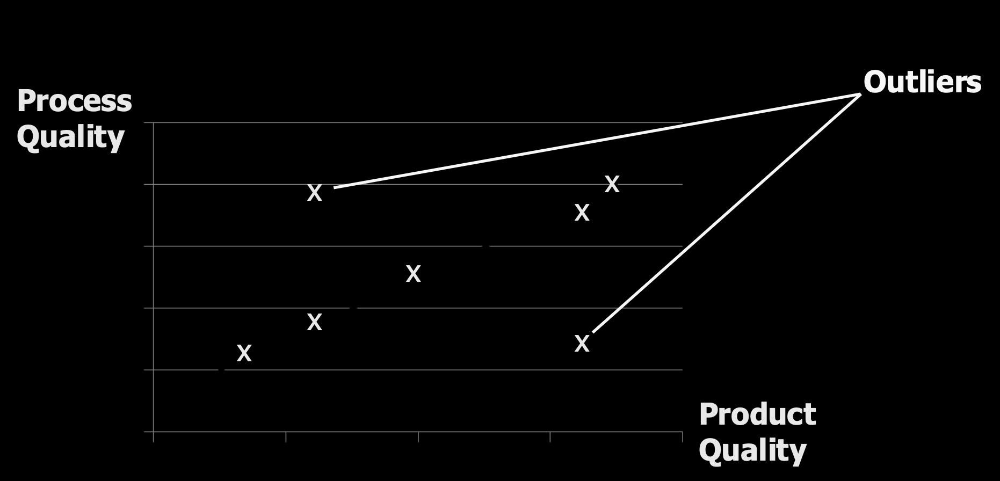

### Modeling and Improving the Process

To understand and improve a process, we first need to describe it.

- A Process is the set of activities involved in software development.
- Process Models are abstract representations of these processes. They help us visualize and understand the activities and the information flow between them. These models do not need to be overly formal or completely detailed to be useful.

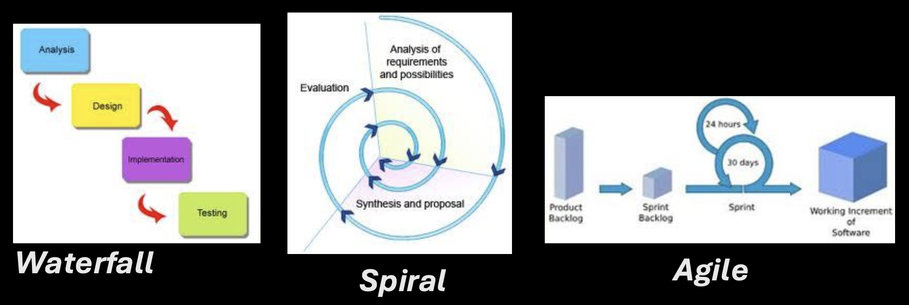

### The Need for Customization and Continuous Improvement

A key insight is that no single, ideal, or standard process exists that fits all situations. The right process depends on:

- The organization's size and culture.
- The background and skills of the staff.
- The type of software product being built.
- Specific customer or market requirements.

Therefore, processes must be customized and are always candidates for improvement.

### What to Improve and How to Improve It

The improvement effort should target process activities that influence product quality. Examples include:

- Core activities like Testing and Reviews.
- Support activities like Version control and maintenance.
- The process itself, measured by attributes like development time or project visibility.

The cycle for process improvement follows a systematic approach:

1. **Measure**: Monitor key attributes of the current process (e.g., defect rates, cycle time).
2. **Analyze**: Evaluate the measurements to identify bottlenecks, weaknesses, or inefficiencies.
3. **Change**: Based on the analysis, identify and apply the necessary changes to the process.

This Measure-Analyze-Change cycle is a cornerstone of both traditional process improvement (like CMMI) and Agile's emphasis on adaptation and retrospectives.

### Process Measurement: The Foundation of Control

To improve a process, you must first understand it quantitatively. This is the principle behind process measurement.

- It involves measuring the process itself, the products it creates, and the resources it uses (like time and people).
- The adage "You can't control what you can't measure" underscores its importance. Without quantitative data, improvement is based on guesswork.
- To collect meaningful data, the process must be clearly defined beforehand. You need to know what you are measuring.

```
+----------------------------------+
|                Constraints       |
|                     |            |
|                     v            |
|               +-----------+      |
|   Goals ----> |  Product  |      |
|               +-----------+      |
|                   ^   |          |
|      Measurement  |   | Action   |
|                   |   v          |
+----------------------------------+

             +-----------+       +-----------+
Needs ---->  |  Process  |       |  Product  |
             +-----------+       +-----------+
               ^     |                 |
               |     |                 |
               |     +-----------------+
           Resources     Measurement
```

### Process Analysis and Change: The Improvement Cycle

Once measurements are collected, the next steps are analysis and change. This involves:

- Improvement identification and prioritization: Deciding which process problems are most important to fix.
- Introducing changes, which can be of different types:
  - Adopting new practices, methods, or processes (e.g., introducing daily stand-up meetings).
  - (Re)ordering of activities (e.g., writing tests before code).
  - Adding or removing deliverables (e.g., reducing mandatory documentation).
  - Adding or removing roles and responsibilities (e.g., creating a dedicated Scrum Master role).
- Training and tuning: Ensuring the team understands the changes and refining them based on initial results.

### Overview of Software Development Approaches

The course focuses on three primary approaches to structuring the software development process:

1. **Waterfall Approach**: A traditional, plan-driven method.
2. **Spiral Development**: An incremental, risk-driven approach.
3. **Agile Software Development**: An iterative, flexible, and collaborative approach (the main focus of this course).

### The Waterfall Approach: A Plan-Driven Cascade

The Waterfall model is characterized by:

```
+----------+          +--------+          +----------------+          +---------+
| Analysis |  ----->  | Design |  ----->  | Implementation |  ----->  | Testing |
+----------+          +--------+          +----------------+          +---------+
```

- Being derived from system engineering processes and is plan-driven.
- All activities are scheduled beforehand in separated, cascaded phases that flow one into the next, like a waterfall.
- Each phase (e.g., Requirements Analysis, Design, Implementation, Testing, Maintenance) produces specific documentation as its primary output before the next phase begins.
- The process is made visible and manageable through this documentation. It is applicable if requirements are well understood and unlikely to change radically.
- Iteration (going back to a previous phase) is possible but is typically seen as a costly exception for fixing errors or handling change requests.

```
       Requirements            Architecture
      specification,              design,                Source               Unit/System
      use case model          detailed design             code                 test docs
             |                      |                      |                      |
    +-----------------+       +------------+       +----------------+        +-----------+       +-------------+
    |  Requirements   |-----> |   Design   |-----> | Implementation |----->  |  Testing  |-----> | Maintenance |
    |    analysis     |       |            |       |                |        |           |       |             |
    +-----------------+       +------------+       +----------------+        +-----------+       +-------------+
             ▲                      ▲                       ▲                      ▲                     ▲
             │                      │                       │                      │                     │
             +----------------------+-----------------------+----------------------+---------------------+
                                           (Faults, change requests)
```

### Spiral Development: An Incremental, Prototype-Based Approach

Spiral Development addresses some Waterfall limitations by being incremental.

- It involves interleaved specification, development, and validation activities, not strictly sequential phases.
- It emphasizes feedback across activities.
- The core of the approach is the development and evaluation of a series of prototypes or increments, with each cycle (spiral) building upon the previous one.

### Advantages and Disadvantages of Spiral Development

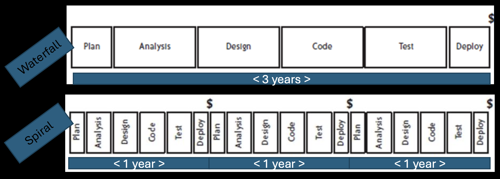

+/ Well-suited for uncertain or changing requirements because feedback is gathered early from each prototype.
–/ Requires a stable software architecture from early on to support the incremental builds.
+/ Suitable for large projects with long development cycles (e.g., releasing a new major prototype every year).

> **Important Note**: Agile software development suggests even shorter development cycles and more rapid feedback than the traditional Spiral model.

### The Motivation for Agile Software Development

The key motivation is the reality of incomplete, imprecise, uncertain, and changing requirements.

- Traditional "plan-driven" approaches (like pure Waterfall) fall short in a fast-moving business environment where change is constant.
- While a complete, up-front analysis (as used in safety-critical systems) has its place, it has drawbacks for general commercial software:
  - It assumes you can define a complete set of requirements at the start, which is often impossible.
  - It is therefore unsuitable for rapid software development where learning and adaptation are needed.

### The Solution Approach

The final slide, "Solution Approach," is left blank, serving as a conceptual bridge. The implied solution to the problems of rigid, plan-driven methods is Agile Software Development itself. Agile provides the framework for embracing change, delivering value frequently, and improving the process continuously through short cycles and tight feedback loops—directly addressing the motivations listed.

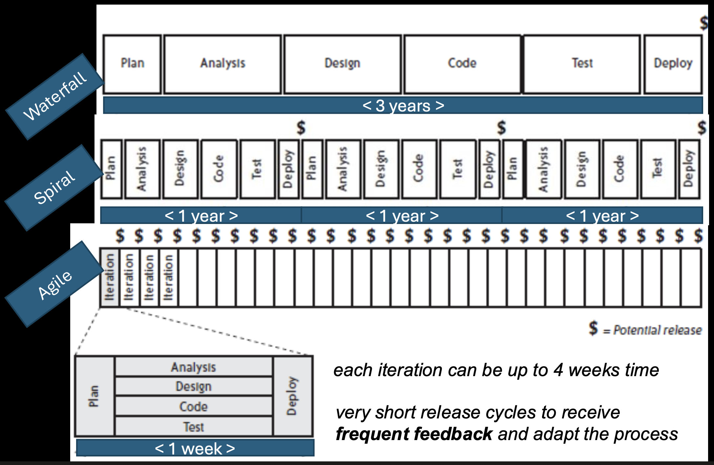

## Agile Software Development, Success, and the Manifesto

### Redefining Project Success

Traditionally, a successful project was defined by being on time, on budget, and fulfilling the specification. However, Agile encourages us to look beyond deadlines and budgets to deeper, more meaningful dimensions of success:

- **Personal Rewards**: Team satisfaction, learning, and growth.
- **Technical Excellence**: Building software well.
- **Elegant, Maintainable Code**: Creating an asset, not just a deliverable.
- **Delivering Value**: The ultimate goal for the customer.

Success has multiple dimensions:

- Organizational Success
- Technical Success
- Personal Success

A truly successful project delivers value across all these dimensions.

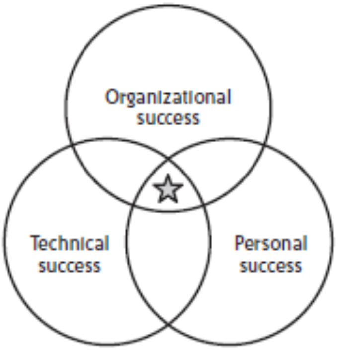

### Organizational Success

This focuses on business outcomes and efficiency:

- Focusing on delivering value to the customer and the business.
- Releasing the most valuable features first and releasing frequently to get feedback and ROI early.
- Being able to change direction to match business needs as they evolve.
- Reducing costs by eliminating waste and inefficiency.
- Achieving technical excellence to ensure long-term sustainability.
- Setting expectations early and maintaining fast communication and steady progress.

### Technical Success

This focuses on the quality and sustainability of the software product itself. Key practices that lead to technical success include:

- **Pair Programming**: Ensures at least two people review every part of the code, improving quality and spreading knowledge.
- **Continuous Integration**: Frequently integrating code to detect problems early.
- Finishing each feature completely before starting the next (the "Definition of Done").
- **Test-Driven Development (TDD)**: Writing tests before code to drive simple, evolvable designs.
- Maintaining simple, evolvable designs that are easy to change.

### Personal Success

This focuses on the human element—the satisfaction and growth of the team:

- The pride in delivery of useful and valuable software.
- Improved technical quality of their work.
- Team autonomy and the ability to self-manage.
- Achieving stakeholder satisfaction through collaboration.

### Changing the Game: A New Way of Working

Agile represents a fundamental shift—developing and delivering software in a new way. This new approach:

- Requires consistency and rigorousness in applying its practices; it is not a loose or undisciplined method.
- Aims to ship valuable software and demonstrate progress on a regular basis (e.g., every iteration).

### What are Agile Methods?

- A method or process is simply a way of working.
- Agile Methods (like Extreme Programming and Scrum) are specific processes that support the agile philosophy.
- These methods consist of individual elements called practices. Examples of practices include:
  - Using version control
  - Setting coding standards
  - Holding weekly demos

### The Core: The Agile Manifesto and Its Principles

The Agile Manifesto is the foundational document. It states that while there is value in the items on the right, we give more value to the items on the left:

1. Individuals and interactions over processes and tools
2. Working software over comprehensive documentation
3. Customer collaboration over contract negotiation
4. Responding to change over following a plan

### The Twelve Basic Principles

The Manifesto is supported by twelve principles. Your slides highlight the following key subset:

**Principles related to delivery and customer focus:**

- Our highest priority is to satisfy the customer through early and continuous delivery of valuable software. (Focus on value and customer satisfaction).
- Welcome changing requirements, even late in development. Agile processes harness change for the customer's competitive advantage.
- Deliver working software frequently, from a couple of weeks to a couple of months, with a preference to the shorter timescale.
- Business people and developers must work together daily throughout the project.
- Build projects around motivated individuals. Give them the environment and support they need, and trust them to get the job done.
- The most efficient and effective method of conveying information is face-to-face conversation.
- Working software is the primary measure of progress.

**Principles related to team, technical, and process excellence:**

- Agile processes promote sustainable development. The sponsors, developers, and users should be able to maintain a constant pace indefinitely.
- Continuous attention to technical excellence and good design enhances agility.
- Simplicity—the art of maximizing the amount of work not done—is essential.
- The best architectures, requirements, and designs emerge from self-organizing teams.
- At regular intervals, the team reflects on how to become more effective, then tunes and adjusts its behavior accordingly.

### Common Philosophies and Approaches

The final slide serves as a heading, indicating that the various Agile methods (Scrum, XP, etc.) all share these **common philosophies and approaches** rooted in the Manifesto and its principles. They represent different implementations of the same core values.

## Scrum

### What is Scrum?

Scrum is one of the most popular Agile methods. It is specifically designed for dealing with uncertainty and complexity in product development. Its foundation is Empirical Process Control theory, meaning it is based on observation, inspection, and adaptation rather than detailed upfront planning. A key benefit is that it provides high visibility into the project's progress and health.

### Empirical Process Control: The Scrum Foundation

Empirical Process Control is about guiding a process step by step, learning from each step, and converging to an acceptable solution. It is built on three pillars:

- **Visibility**: All aspects of the process must be visible to those responsible for the outcome.
- **Inspection**: The artifacts and progress toward the goal must be inspected frequently.
- **Adaptation**: If inspection reveals the process is deviating or the outcome is unacceptable, adjustments must be made immediately.

Scrum implements this through a 24-hour inspection cycle (the Daily Scrum) and a regular, iterative cadence.

### Scrum Overview: The Basic Cycle

Scrum is an iterative and incremental framework.

- It features a daily inspection of activities (the Daily Scrum).
- The project is broken into fixed-length cycles called Sprints (or Iterations).
- This cycle continues until the project is no longer funded or the goal is achieved.

### The Scrum Steps in an Iteration (Sprint)

Each Sprint follows a pattern:

- Review requirements from the prioritized backlog.
- Select a shippable functionality (a set of backlog items) to commit to for the Sprint.
- The team makes its best effort during the iteration to complete that functionality.
- At the end, there is an inspection of the functionality by stakeholders (the Sprint Review).
- Based on the inspection, the team makes timely adaptations to the product (backlog updates) and process (in the Sprint Retrospective).

During an iteration, the team figures out what needs to be done and selects the best way to do it, repeatedly.

- They evaluate requirements, available technology, skills, and capabilities and collectively determine what and how to build.
- They modify their approach daily based on emerging complexities, difficulties, and surprises.

### The Three Core Scrum Roles

Scrum defines three specific roles with distinct responsibilities:

#### A. The Product Owner:

- Responsible for clarifying requirements and defining release plans.
- Ensures that the most valuable functionality is produced first.
- Manages the Product Backlog, which is the list of frequently prioritized requirements.

#### B. The Team:

- A self-managing, self-organizing, and cross-functional group of professionals.
- They decide how to turn the Product Backlog items into a potentially shippable product increment. No one tells the team how to do their work.

#### C. The ScrumMaster:

- This is not a traditional project manager.
- The ScrumMaster is a servant-leader for the team, responsible for:
  - Making sure that all decisions, problems, and progress are visible to everyone.
  - Ensuring that the team follows the Scrum rules and practices.
  - Preventing external interrupts from disrupting the team during a Sprint.

Distinction: The slides mention the classic "pigs and chickens" metaphor. The "pigs" (the Product Owner, ScrumMaster, and Team) are fully committed and accountable for the project's success. The "chickens" (stakeholders, managers, customers) are involved but not accountable for delivery.

### Scrum Ceremonies (Meetings)

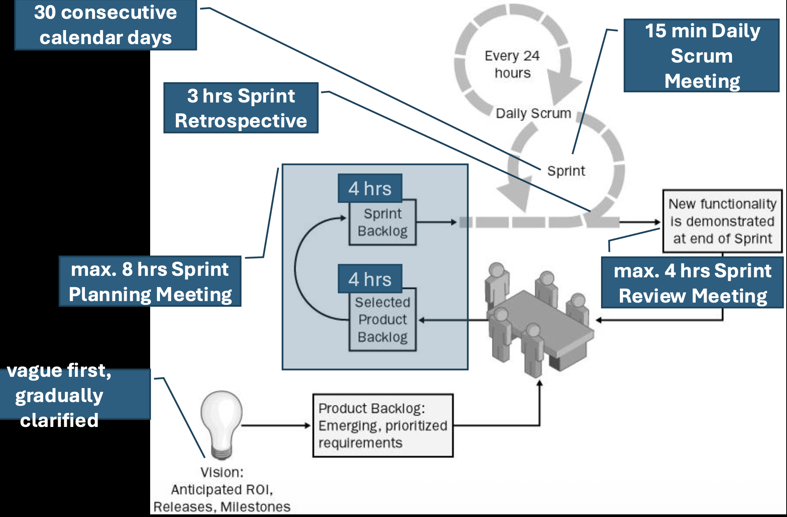

Scrum replaces extensive documentation with frequent, structured communication through meetings. These are the core empirical inspection and adaptation points:

- **Sprint Planning Meeting**: At the start of a Sprint. The product owner and the team discuss and select the most valuable and releasable functionality to focus on for the upcoming Sprint.
- **Daily Scrum**: A 15-minute daily meeting for the Team (and ScrumMaster) to synchronize by discussing progress, plans for the day, and any impediments.
- **Sprint Review**: Held at the end of the Sprint. The team presents the results (the working increment) to the stakeholders for feedback.
- **Sprint Retrospective**: Also held after the Sprint. The team meets to revise their development process, discussing what went well and what could be improved for the next Sprint.

The philosophy is more meetings, less documentation, with the meetings ensuring alignment, transparency, and rapid adaptation.

## Scrum Artifacts – Product Backlog, Sprint Backlog, and Burndown Chart

### The Product Backlog: The "What"

The Product Backlog is the single, authoritative source for everything that might be needed in the product. It is a dynamic, prioritized list of features, functions, enhancements, and fixes.

- **Ownership**: The Product Owner is solely responsible for the backlog's contents, prioritization, and availability. The team may help with estimation, but the PO owns the "what" and "why."
- **Nature**: It is a dynamic, evolving, and never complete list. As the product and market change, new items are added, and priorities are re-ordered.
- **Content**: Each item (often called a Product Backlog Item or PBI) should have a description and an initial estimate (often in relative units like story points) to aid in planning. The table in the slide shows a backlog with items like "Create product backlog worksheet" and their estimates.
- **Visualization**: It is often maintained in a tool (like the worksheet shown) that allows for easy viewing and updating of priorities.

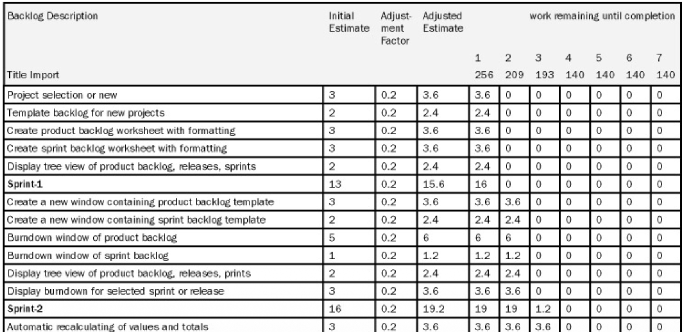

### The Sprint Backlog: The "How" for the Current Sprint

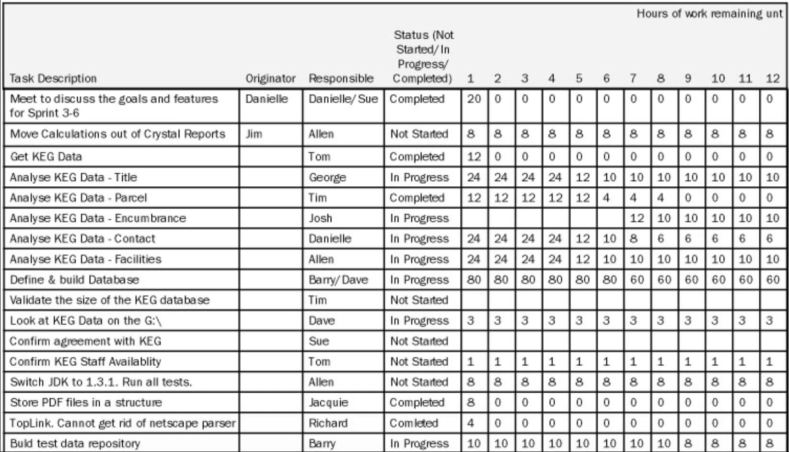

The Sprint Backlog is the set of Product Backlog items selected for the current Sprint, plus a plan for delivering them. It is a real-time picture of the work the Team plans to accomplish during the Sprint.

- **Creation**: It is composed at the second part of the Sprint Planning Meeting. In the first part, the what is decided (which PBIs to do). In the second part, the team figures out the how and breaks those PBIs down into tasks.
- **Content**: It defines the tasks for completing the selected functionality. The slide's table is a classic Sprint Backlog example. It lists tasks (e.g., "Analyze KEG Data - Title"), their originator, the responsible team member, and their status (Not Started, In Progress, Completed).
- **Task Granularity**: A good rule is that each task should take 4 to 16 hours to finish. This makes progress easy to track daily.
- **Ownership & Visibility**: The Sprint Backlog can be modified only by the Team as they learn more during the Sprint. It must be highly visible, typically displayed on a physical or digital task board.

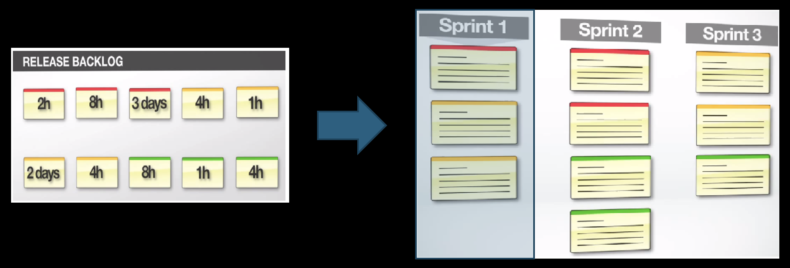

### The Increment: The "Done" Result

The goal of each Sprint is to produce an Increment of potentially shippable product functionality.

- This means the work is "Done" according to a shared team definition, which usually includes being thoroughly tested, well-structured, well-written, and documented (e.g., with usage in help files).
- Each Increment adds to all previous Increments and must be in a working, integrated state.

### The Burndown Chart: Tracking Progress Visually

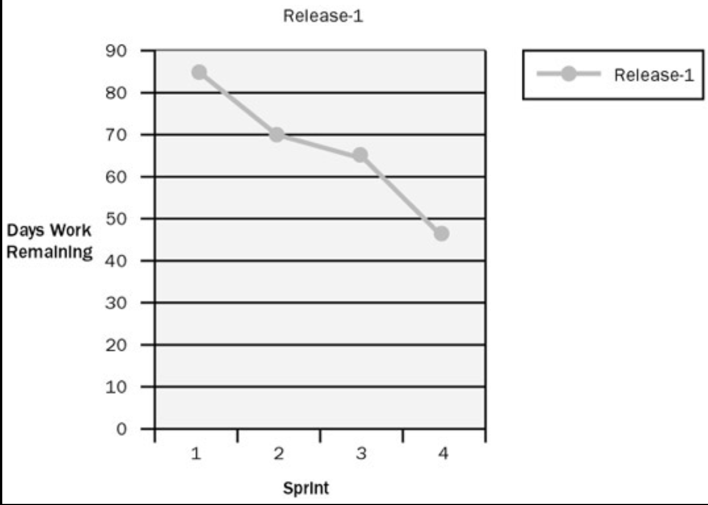

The Burndown Chart is a simple, powerful tool for visualizing progress vs. work to be done.

- Purpose: It shows the amount of work remaining across time. The ideal trend is a line that "burns down" to zero by the end of the Sprint.
- How it works:
  - The vertical axis represents the Total Work Remaining (usually in hours of task effort, as shown in the slide's example starting at 38h).
  - The horizontal axis represents time (the days of the Sprint).
  - Each day, the team updates the chart by summing the remaining effort on all unfinished tasks. If they completed 4 hours of work, the line goes down by 4. If they discover new work, the line may go up.

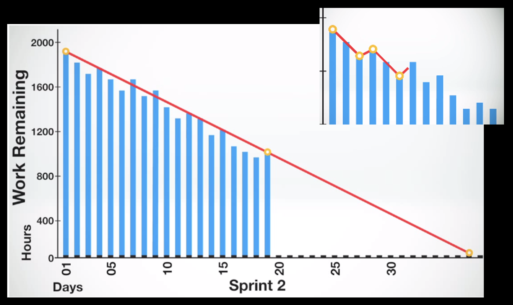

> **Example**: The text "2h 4h 2 days 4h 8h 4h Total Work Remaining: 38h 44h Day 2" suggests a scenario: perhaps on Day 2, the team finished 6 hours of work (2h+4h), but also added or discovered 12 new hours of work, causing the total remaining to increase from 38h to 44h. This makes impediments and scope change immediately visible.

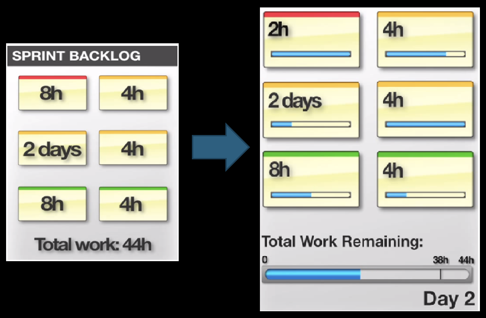

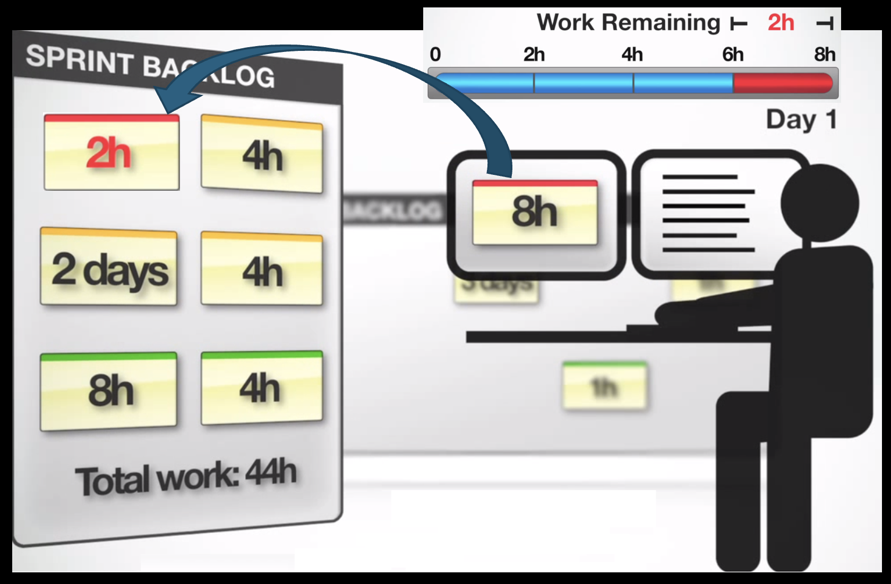

## Advanced Scrum Concepts and Ceremonies

### Scaling and Adaptation: Scrum of Scrums

When multiple Scrum Teams work on a single, large product, a Scrum of Scrums meeting is used to coordinate.

- It is designed for heavily interdependent teams.
- Each team sends a part-time shared member (often a representative or the ScrumMaster) to this meeting. This person is responsible for keeping track of the big picture and influencing every team.
- The rationale is that a pure implementation of Scrum within each team is not always enough for complex projects. Since Scrum is based on empirical control theory, it states: as the degree of complexity rises, the number of inspections must be increased. The Scrum of Scrums is an additional inspection point. As the frequency of inspections increases, the opportunity for adaptation also increases.

### The Core Strengths of Scrum

#### A. The Power of Timebox:

The fixed-length Sprint (timebox) creates focus and reduces complexity.

- It forces a focus on what is possible within a limited time.
- It encourages team collaboration to solve a real problem.
- It aids in reducing complexity by breaking down problems into manageable chunks.
- It becomes the art of what is possible.

#### B. The Power of Communication:

Scrum maximizes communication through structured and informal channels.

- Daily Scrums and informal meetings ensure everyone knows about progress and problems.
- This open communication means people might know solutions for problems of others, fostering collective problem-solving.

#### C. Customer Collaboration:

Scrum directly addresses a common failure of traditional methods.

- Claim 1: Introducing many formal software engineering practices can widen the gap between stakeholders and developers.
- Claim 2: Heavy reliance on documentation replaced face-to-face communication.
- The Scrum solution: The team and the Product Owner have to communicate frequently. Furthermore, the team should talk in terms of business needs and objectives, not just technical details.

### Terminology and the Sprint Planning Meeting

The use of terms is not so important; what matters is the essence. A Product Backlog is just a prioritized list of requirements, and a Sprint is just a period (e.g., one month) between meetings.

The Sprint Planning Meeting is an 8-hour, timeboxed event that kicks off the Sprint.

- **First 4 hours**: The Product Owner and Team collaborate on selecting Product Backlog items for the Sprint. The Product Owner must prepare the Product Backlog before the meeting.
- **Second 4 hours**: The Team alone prepares the Sprint Backlog. They break down the selected PBIs into tasks, create task estimates, and make assignments. The goal is to make the plan complete enough for a confident commitment.
- **Outcome**: A set of selected Product Backlog items committed by the team to be turned into an increment of shippable functionality.
- **Clarification**: The Product Owner takes part in the second part just to clarify Product Backlog items further, if necessary.
- **Embracing Uncertainty**: The timebox is strict although the Product Backlog items and the time estimates are imprecise. The team accepts that the rest must be resolved during the Sprint through daily adaptation.

### The Daily Scrum: The 15-Minute Sync

A strict **15-minute** meeting held at the same place and same time every day. Everybody on the Team must attend promptly.

- **Format**: Each team member answers just three questions:
  1. What have I done for the project since the last daily scrum meeting?
  2. What will I do until the next daily scrum meeting?
  3. What impedes me from performing my work as effectively as possible?
- **Rules**: One person at a time, discussion is kept in the scope of the three questions, and nobody outside the team interferes.

### The Sprint: Rules and "Done"

A Sprint is 30 calendar days (or less). During the Sprint:

- The Team can seek outside advice, help, and information.
- The Product Backlog is frozen (i.e., no new goals are added by the PO mid-Sprint).
- Team responsibilities include: attending Daily Scrums and keeping the Sprint Backlog up-to-date and visible to everyone (e.g., updating day-to-day estimated hours for each task).
- Problems: The ScrumMaster can abnormally terminate the Sprint if it becomes non-viable due to major business/technological changes or severe interference.

#### Definition of "Done":

For an increment to be considered "Done," it must be more than just coded. The slide's checklist includes:

- Feature complete
- Code complete
- Approved by the Product Owner
- No known defects
- Production Ready

### The Sprint Review: Inspecting the Product

A 4-hour meeting at the end of the Sprint.

- **Preparation**: At most 1 hour for preparation.
- **Content**: The team should present no artifacts, only functionality that is ‘done’. They discuss initial plans, what went well, and what did not.
- **Interaction**: There is an Answers & Questions session with stakeholders to get their impressions and desires.
- **Outcome**: This leads to a reconsideration of the Product Backlog and its prioritization for future Sprints.
- **Facilitation**: The ScrumMaster organizes the meeting.

### The Sprint Retrospective: Inspecting the Process

A 3-hour meeting for the Team, the ScrumMaster, and the Product Owner after the Sprint Review.

- The team reflects: What went well, what did not?
- The Team prioritizes possible improvements to their process.
- The ScrumMaster is responsible for the arrangements.
- Actionable items from the retrospective can be formulated as high-priority non-functional Product Backlog items for the next Sprint, ensuring process improvements are acted upon.

## Scrum Principles, Artifacts, and Metrics

### The Scrum Lifecycle (Big Picture)

The Scrum Lifecycle is a high-level view of how a project progresses from start to finish using Scrum. While not detailed in the slide, it typically involves:

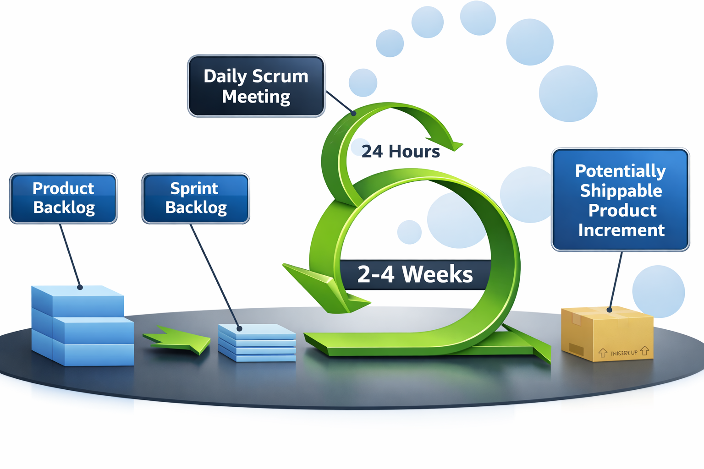

- Product Backlog Creation & Refinement: Continuously managing the single source of requirements.
- A Series of Sprints: The project is executed through repeated cycles (Sprints), each following the pattern: Sprint Planning -> Daily Scrums -> Development Work -> Sprint Review -> Sprint Retrospective.
- Release: After one or more Sprints, a Potentially Shippable Product Increment is released to users.
- This cycle repeats until the product is complete or funding ends.
